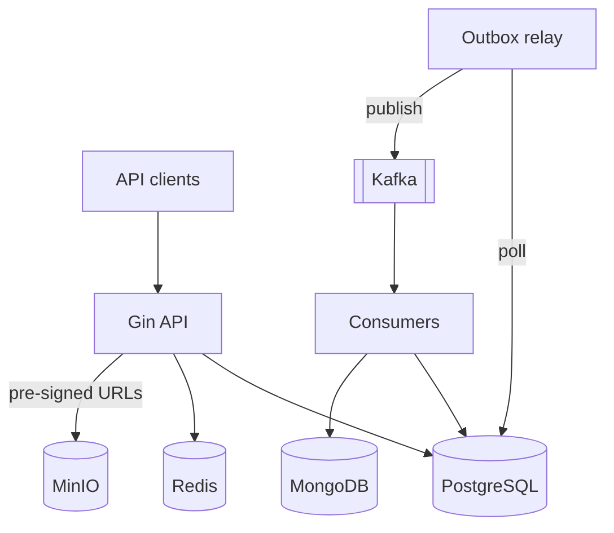

# SmartCourse

A course-delivery platform backend for EduCorp: course authoring and publishing, enrollment, progress tracking, and analytics — built to stay consistent and observable under concurrent load, not just functionally correct in a single-user test.

This README is the fast path to running the system and finding your way around. For *why* it's built this way, see the docs linked at the bottom — they're not optional reading, they're where every non-obvious decision is actually explained.

## Quick start

```bash
cp env.example .env          # fill in real values; nothing here has a working default (see env.example)
make dev-core                # Postgres, Redis, MinIO
make migrate-up              # apply the full schema
make run-api                 # http://localhost:8080
```

Check it's alive:

```bash
curl localhost:8080/health/live
curl localhost:8080/health/ready
```

That's two containers, not the dozen the full stack eventually needs (Kafka, Temporal, MongoDB, the observability stack). Those come up via `make dev-workflow` / `make dev-events` / `make dev-observability` / `make dev-full` as you need them — see [`docs/adr/smartcourse-adr.md` ADR-0018](docs/adr/smartcourse-adr.md#adr-0018--docker-compose-profiles-for-tiered-local-development) for why the environment is tiered instead of all-or-nothing.

## Architecture, in one paragraph

PostgreSQL is the single system of record (everything a user can assert as fact about their own account — enrolled, completed, certified — is strongly consistent, enforced by database constraints, not application code that can race). Redis and MongoDB hold only derived, rebuildable data. State changes are recorded and their side effects (search indexing, analytics, notifications, caching) happen asynchronously via a transactional outbox, so a crash mid-request never silently loses work or desyncs a dashboard from reality — today via an in-process worker-pool relay ([ADR-0021](docs/adr/smartcourse-adr.md#adr-0021--in-process-outbox-relay-with-a-worker-pool-ahead-of-kafka)), migrating to Kafka in M3 without changing this guarantee. One Go binary runs in two modes — `--mode=api` for HTTP, `--mode=worker` for everything asynchronous — so API and worker code can never drift apart.



Full diagrams, the consistency model, and the reasoning behind every major choice: [`docs/rfc/smartcourse-rfc.md`](docs/rfc/smartcourse-rfc.md). Every individual decision, including the ones that were reconsidered and changed: [`docs/adr/smartcourse-adr.md`](docs/adr/smartcourse-adr.md).

## Repository layout

```
cmd/smartcourse/     Entry point; --mode=api|worker
internal/
  platform/          Shared kernel: config, db, cache, auth, errors, httpx, outbox, router
  identity/ course/ enrollment/ progress/    Domain modules (each has its own README)
  analytics/                                 Built — outbox relay's first handler (ADR-0021)
  search/ notification/ audit/               Not yet built — same relay-handler pattern as analytics
  workflows/         Temporal definitions (M2)
migrations/          Versioned SQL schema (golang-migrate) — see migrations/README.md
docs/
  for-the-devs/      Start here — onboarding, setup, architecture in brief
  baseline/          The frozen commissioning brief — never edited
  prd/ rfc/ adr/     Living design documents
  guides/            How-to docs, including testing.md
api/                 openapi.yaml — the API contract
proto/               Event schemas (M3 — empty today, see proto/README.md)
test/integration/    Cross-module integration and concurrency tests
deploy/              Compose service config (Grafana dashboards, Prometheus scrape config)
```

Every top-level directory has its own `README.md` explaining what it's for — this map is the summary, not the whole story.

Every domain module under `internal/` follows the same shape (`handler.go`, `service.go`, `repository.go`, `dto.go`, `domain.go` — see [`docs/rfc/smartcourse-rfc.md` §4.3](docs/rfc/smartcourse-rfc.md)), and none of them import each other's `repository`/`domain` types directly — cross-module reads go through a consumer-declared interface, enforced by `.golangci.yml`'s `depguard` rules, not just code review.

## API overview

REST over JSON, versioned under `/api/v1`. Full contract: `api/openapi.yaml` (tracked as it's written, module by module). Summary by module:

| Module | Surface |
|---|---|
| `identity` | register, login, refresh, logout, profile, password reset, email verification |
| `course` | course/module/lesson CRUD, catalogue (keyset-paginated), publish |
| `enrollment` | enroll, withdraw, my-courses, roster |
| `progress` | mark lesson complete, progress (certificates not yet built — see `docs/rfc/smartcourse-rfc.md` §21.0) |
| `analytics` | platform-wide metrics (`GET /analytics/platform`) — populated asynchronously by the outbox relay, not written directly by any handler above |

Errors are always `{ "code", "message", "details" }` with a stable, documented `code` — never a raw stack trace or database error (see `internal/platform/errors`).

## Tech stack

Go 1.25+, Gin, GORM (bounded to simple CRUD — see [DR-004](docs/rfc/differences-from-requirements.md#dr-004--gorm-is-bounded-to-simple-crud-raw-sql-elsewhere)) + raw SQL for complex queries, PostgreSQL, Redis, MongoDB, Apache Kafka + Confluent Schema Registry, Temporal, Asynq, MinIO (S3-compatible — [ADR-0019](docs/adr/smartcourse-adr.md#adr-0019--minio-for-learning-asset-object-storage)), OpenTelemetry + Prometheus + Grafana + Jaeger, Docker Compose.

**Currently running, not just specified:** Go, Gin, GORM, PostgreSQL, Redis (cache, rate limiting), Docker Compose. MongoDB, Kafka, Schema Registry, Temporal, and Asynq are still M2/M3 — see `docs/rfc/smartcourse-rfc.md` §21.0 for exactly what's built versus designed.

## Testing

Unit, integration (real Postgres via testcontainers), and concurrency tests, each documented — what they check and how to run them — in [`docs/guides/testing.md`](docs/guides/testing.md).

```bash
make test            # unit tests
make test-race       # everything, with the race detector (always on in CI)
make test-integration # integration + concurrency suite against real Postgres
```

## Where to start reading

**New to this codebase?** Start at [`docs/for-the-devs/GETTING_STARTED.md`](docs/for-the-devs/GETTING_STARTED.md) — laptop setup, how to run tests, the architecture in brief, and what to know before your first change. It's a better starting point than this README, which is a reference, not a walkthrough.

## Document map

| Document | What it's for |
|---|---|
| [`docs/for-the-devs/GETTING_STARTED.md`](docs/for-the-devs/GETTING_STARTED.md) | Onboarding: setup, tests, architecture in brief, prerequisite knowledge. Start here. |
| [`docs/baseline/SmartCourse.md`](docs/baseline/SmartCourse.md) | The original commissioning brief. Frozen; never edited. |
| [`docs/baseline/Execution Guidelines.md`](docs/baseline/Execution%20Guidelines.md) | The original execution/assignment guidelines. Frozen; never edited. |
| [`docs/prd/smartcourse-prd.md`](docs/prd/smartcourse-prd.md) | Product requirements: use cases, FR/NFR, traceability. |
| [`docs/rfc/smartcourse-rfc.md`](docs/rfc/smartcourse-rfc.md) | The architecture, in full, and why. |
| [`docs/rfc/differences-from-requirements.md`](docs/rfc/differences-from-requirements.md) | Every place the design adds to or reinterprets the frozen brief, and why. |
| [`docs/adr/smartcourse-adr.md`](docs/adr/smartcourse-adr.md) | Every individual architecture decision as a point-in-time record. |
| [`docs/guides/testing.md`](docs/guides/testing.md) | Test categories: what each checks, how to run it. |
