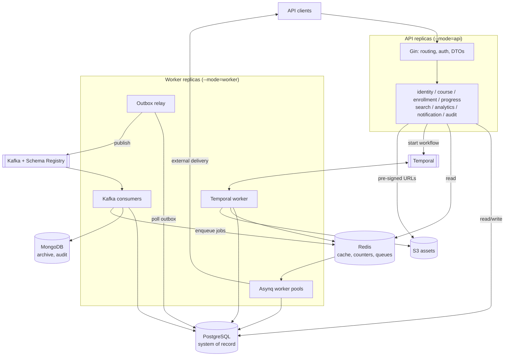

# RFC-001 — SmartCourse Backend Architecture

| Field | Value                       |
|---|-----------------------------|
| Status | Draft — open for review     |
| Version | 0.1                         |
| Author | [Engineer]                  |
| Reviewers | [Mentor]                    |
| Last updated | 2026-09-24                  |
| Supersedes | —                           |
| Related | `smartcourse-adr.md`, `differences-from-requirements.md`, `/docs` |

> This document describes the system as currently designed. It is expected to change. When a decision is reversed during implementation, this document is edited **and** a superseding ADR is added to `docs/adr/`, so the reasoning history survives the edit. A decision changed with a recorded rationale is a healthy outcome; a decision changed silently is not.

---

## Table of contents

1. [Context and problem statement](#1-context-and-problem-statement)
2. [Goals, non-goals, and assumptions](#2-goals-non-goals-and-assumptions)
3. [Consistency model](#3-consistency-model)
4. [Architecture overview](#4-architecture-overview)
5. [Data architecture](#5-data-architecture)
6. [Event architecture](#6-event-architecture)
7. [Course lifecycle and the publishing workflow](#7-course-lifecycle-and-the-publishing-workflow)
8. [Enrollment, progress, and certificates](#8-enrollment-progress-and-certificates)
9. [Analytics](#9-analytics)
10. [Concurrency model](#10-concurrency-model)
11. [Security](#11-security)
12. [Observability](#12-observability)
13. [Non-functional requirements](#13-non-functional-requirements)
14. [Failure analysis](#14-failure-analysis)
15. [API surface](#15-api-surface)
16. [Data lifecycle](#16-data-lifecycle)
17. [Local development and operations](#17-local-development-and-operations)
18. [Testing strategy](#18-testing-strategy)
19. [Rejected alternatives](#19-rejected-alternatives)
20. [Deferred decisions](#20-deferred-decisions)
21. [Delivery plan](#21-delivery-plan)
22. [Onboarding path](#22-onboarding-path)
23. [Glossary](#23-glossary)
24. [ADR index](#24-adr-index)

---

## 1. Context and problem statement

EduCorp operates a learning platform whose growth has outpaced its original design. Five problems were identified in the commissioning brief, and each maps to a specific architectural cause rather than a missing feature:

| Stated problem | Architectural cause | Where this RFC addresses it |
|---|---|---|
| Content publishing is slow and manual | Publishing side effects run inline and serially, with no orchestration or recovery | §7 — durable workflow, concurrent activities |
| Students cannot discover courses effectively | No dedicated read model for search; queries run against normalised OLTP tables | §5.6 — denormalised search index |
| Course, progress, and analytics data disagree | Dual writes — state is committed in one place and published to another non-atomically, so any crash between them permanently desynchronises the two | §6.2 — transactional outbox |
| Latency under heavy traffic | Synchronous request paths perform work that does not need to block the caller | §3.4 — sync/async boundary |
| Operational data not processed for reporting or audit | No event log; operational history is discarded | §6, §5.4 — Kafka plus a durable archive |

The unifying cause is that **state changes and their consequences are not separated**. The design below separates them: a request commits state and records an intent; everything downstream is derived, asynchronous, and rebuildable.

### 1.1 Why this is a backend-only design

No user interface is in scope. The API is the product surface, and the OpenAPI specification is the contract. Where a design decision depends on how a frontend would consume the system, that reasoning is stated explicitly (see §5.5, which is decided on frontend access patterns).

---

## 2. Goals, non-goals, and assumptions

### 2.1 Goals

**G1 — Correctness under concurrency.** Enrollment limits, duplicate prevention, and progress tracking remain correct when many users act simultaneously. Correctness is enforced by the database where possible, not by application-level checks that race.

**G2 — No lost work.** A committed state change always produces its downstream effects, eventually. Crashes delay effects; they do not discard them.

**G3 — Low latency on user-facing paths.** A user waits for durability, never for a side effect.

**G4 — Diagnosability.** Any request or background task can be traced end to end, and any failure can be attributed to a component and a cause without reading application logs line by line.

**G5 — Contributor accessibility.** A competent engineer unfamiliar with Go or this domain can understand the structure, run the system, and make a safe change. Uniformity of structure is preferred over local cleverness. This is not a hypothetical courtesy: delivery is solo today but is confirmed to grow to a team (RFC assumption A9), which makes G5 a load-bearing requirement rather than aspirational polish. Documentation and test coverage are scoped accordingly — see §18 and the PRD's §9 — specifically so the original author never becomes a single point of failure for understanding the system.

**G6 — Scale headroom.** The design must not contain decisions known to fail at tens of thousands of concurrent learners, even though that load will not be generated or measured in this phase.

### 2.2 Non-goals

Stated explicitly to bound scope and to preempt "why was X not considered":

- **Payments, billing, subscriptions.** Courses have no price.
- **Video hosting, transcoding, streaming.** Assets are referenced, not processed.
- **Quizzes, assessments, grading.** Completion is self-reported per lesson.
- **Live sessions, chat, forums, social features.**
- **Multi-tenancy.** One logical institution. Tenant isolation is not modelled.
- **Internationalisation and localisation.**
- **Recommendation engine.** "Most popular courses" is a ranked count, not personalisation.
- **Mobile or offline sync.**
- **Production deployment, Kubernetes, IaC, autoscaling.** Docker Compose is the deployment target.
- **Measured load testing.** Scale is a design constraint (G6), not a verified property.

### 2.3 Assumptions

Recorded so a reader can distinguish what was decided from what was assumed. Each is falsifiable; if one proves wrong, the linked section is the one to revisit.

| # | Assumption | Affects | If wrong |
|---|---|---|---|
| A1 | ~~Assumption~~ **Decision (ADR-0019):** learning assets are stored in MinIO, run locally as S3-compatible object storage — a component not present in the SmartCourse.md tech stack, added because "upload learning materials" has no answer without one, and logged in `docs/rfc/differences-from-requirements.md`. The backend issues pre-signed upload URLs; asset bytes never transit the API. | §7.4, §11.7, ADR-0019 | N/A — settled, not assumed |
| A2 | Asset verification means confirming existence, content type, and size — not inspecting or transcoding content | §7.4 | The verification activity becomes long-running and needs its own timeout and retry profile |
| A3 | Certificates are records with a verification code, not rendered PDF documents | §8.4 | A rendering step and a storage location are added |
| A4 | A course is authored by a single instructor | §5.2, §11.4 | Ownership becomes a join table; authorisation checks change shape |
| A5 | Students always see the latest published version of a course | §7.2, §8.3 | Enrollments pin a version; progress and content resolution change materially |
| A6 | Roles are fixed: `student`, `instructor`, `admin`. A user holds exactly one | §11.4 | A role or permission table replaces the enum |
| A7 | Email and push delivery are external providers, treated as unreliable and rate-limited | §6.7 | Delivery may collapse into a Kafka consumer if it becomes a local, reliable operation |
| A8 | Single region, single Postgres primary, no read replicas | §13 | Read/write splitting introduces replica lag as a consistency concern |
| A9 | Solo implementation, with documentation sufficient for later contributors | §17, §22 | Module ownership and parallel work streams would need defining |
| A10 | Audit and event history are a genuine product requirement, queried by administrators | §5.4, §16 | MongoDB is removed; see §19.9 |
| A11 | An earlier draft of the Execution Guidelines referenced **Celery** for background workers. Celery is a Python library with no Go client, so it was removed from that document by the document owner as a correction — it doesn't appear in the current baseline. The capability it pointed at — queued background jobs with retry and scheduling — is delivered by **Asynq**, per the stack in SmartCourse.md, on its own merits (§19.3), independent of the removed reference | §6.7, §19.3 | Not applicable — the source reference no longer exists |

---

## 3. Consistency model

This is the root section. The schema, the event design, the sync/async split, and the analytics approach are all derived from it. If a decision here is wrong, most of what follows inherits the error.

The commissioning brief asks for both **"high consistency and accuracy across all data models"** and **an event-driven asynchronous architecture**. These pull against each other. Rather than paper over the tension, this design resolves it by classifying every piece of state and stating what guarantee it carries.

### 3.1 Strongly consistent state

Read-your-writes, transactionally enforced, in a single PostgreSQL transaction boundary:

- User identities, credentials, roles
- Course identity, lifecycle state, and version pointers
- Course content (modules, lessons) as versioned snapshots
- Enrollments and their status
- Lesson-level progress and course completion
- Certificates
- The outbox

**Invariant:** anything a user can assert as fact about their own account — "I am enrolled", "I completed that lesson", "I hold this certificate" — is strongly consistent. Being told you enrolled and then not seeing the enrollment is unacceptable; that class of bug is designed out rather than monitored for.

### 3.2 Eventually consistent read models

Derived state. Never a source of truth. Each is fully rebuildable.

| Read model | Store | Staleness target (p95) | Rebuilt from |
|---|---|---|---|
| Search index | Postgres (`course_search_index`) | ≤ 5 s | Postgres scan, or `course.events` replay |
| Course outline cache | Redis | ≤ 10 s, invalidated on publish | Postgres |
| Analytics aggregates | Postgres (`analytics_*`) | ≤ 60 s | Kafka replay |
| Popularity counters | Redis, periodically reconciled | ≤ 60 s | Postgres aggregate |
| Event archive and audit log | MongoDB | ≤ 60 s | Kafka replay within retention |
| Notifications | External providers | Best effort, at-least-once | Not rebuildable — see §6.7 |

**Rebuildability is the design rule that makes eventual consistency safe.** If a read model can be reconstructed, a bug in it is an operational inconvenience rather than data loss. This is the primary justification for Kafka over a plain task queue (§19.3), and it is the direct answer to the brief's complaint that dashboards disagree with platform state: when they disagree, the dashboard is rebuilt from the log.

Staleness targets are goals for this phase, not measured SLOs. They exist so that "eventually" has a number attached and so a reviewer can tell whether an observed delay is acceptable or a fault.

### 3.3 What a user observes

Stated plainly, because these are the behaviours a reviewer will probe:

- Enroll returns `201`; the enrollment is immediately visible in "my courses"
- The enrollment count shown on a course card may lag by seconds
- Publishing returns `202`; the course becomes searchable within seconds of reaching `Ready`
- Completing a lesson updates progress immediately; the completion-rate dashboard lags
- A failed publish never changes what students currently see

### 3.4 The synchronous/asynchronous boundary

**Synchronous** — the user waits:

Authentication · all reads · course and content CRUD · enrollment · withdrawal · progress updates · certificate retrieval · search queries · analytics dashboard reads

**Asynchronous** — the user does not wait:

The publishing pipeline · search index updates · analytics aggregation · notification delivery · cache warming · certificate issuance · event archival · audit writes

**The rule:** a synchronous request may write to PostgreSQL and read from PostgreSQL or Redis. It may not call Kafka, Temporal (beyond starting a workflow), an external provider, or MongoDB. Any work that does not affect what the caller is told becomes an outbox row.

This rule is what keeps the p95 targets in §13 achievable, and it is checkable in code review without measurement.

---

## 4. Architecture overview

### 4.1 Deployment shape — modular monolith

| Criterion | Modular monolith | Microservices |
|---|---|---|
| Transactional integrity | Enrollment, progress init, and outbox commit atomically | Distributed saga for a small, naturally atomic write |
| Operational surface | One binary, two run modes | 6+ services on top of ~10 infrastructure containers |
| Delivery feasibility (solo, weeks) | Achievable | Not achievable |
| Horizontal scaling | Stateless replicas behind a load balancer | Independent per-service scaling |
| Failure isolation | Shared process — one module can exhaust shared resources | Strong isolation |
| Later extraction | Low cost **if boundaries hold** | N/A |

**Decision: modular monolith.** There is no independent-scaling requirement, no team-autonomy requirement, and the enrollment path benefits materially from a local transaction. Microservices here would add distributed-transaction complexity to solve problems the system does not have.

The honest cost is failure isolation: a runaway goroutine in one module degrades the whole process. §10.4 addresses this with bounded concurrency; it does not eliminate it.

### 4.2 Run modes

One binary, two modes, selected by flag:

- `--mode=api` — HTTP server. Stateless. Scales horizontally behind a load balancer.
- `--mode=worker` — outbox relay, Kafka consumers, Asynq workers, Temporal worker. Scales independently.

One build and one image, so a shared domain change cannot produce a version skew between API and workers. Consumer-group and queue semantics make worker replicas safe to add.

### 4.3 Modules

Eight domain modules plus a shared kernel. Every module has the same internal shape:

```
internal/<module>/
  handler.go       HTTP — DTO binding, validation, status codes
  service.go       Domain logic, transactions, authorisation
  repository.go    Data access — the only file importing GORM
  consumer.go      Kafka consumers (where applicable)
  jobs.go          Asynq handlers (where applicable)
  dto.go           Request and response types
  domain.go        Entities, value objects, errors
```

| Module | Owns | Sync surface | Async surface |
|---|---|---|---|
| `identity` | Users, credentials, roles, refresh tokens | Register, login, refresh, logout, profile | — |
| `course` | Courses, versions, modules, lessons, lifecycle | Catalogue, detail, CRUD, publish | Publishing activities |
| `enrollment` | Enrollments, seat limits, prerequisites | Enroll, withdraw, my-courses, roster | — |
| `progress` | Lesson progress, completion, certificates | Mark complete, progress, certificates | Certificate issuance |
| `search` | Search index | Query | Index consumer |
| `analytics` | Aggregates, counters | Dashboard reads | Aggregation consumers |
| `notification` | Preferences, notification records | Preferences, list | Delivery jobs |
| `audit` | Event archive, audit log | Admin query | Archive consumer |

**Shared kernel** (`internal/platform/`): outbox, event envelope and codecs, idempotency, telemetry, errors, config, database and Redis clients, auth middleware.

### 4.4 Boundary enforcement

Two rules, both mechanically checkable:

**1. No module imports another module's `repository`, `domain`, or GORM models.** Cross-module reads go through an interface declared by the *consumer*:

```go
// internal/enrollment/service.go — enrollment declares what it needs
type CourseReader interface {
    GetPublishedCourse(ctx context.Context, id uuid.UUID) (CourseSummary, error)
}
```

`course` supplies an implementation. `enrollment` depends on its own narrow contract, not on `course`'s internals. Extraction to a service later means swapping the implementation for an RPC client — one file, no call-site changes.

**2. Cross-module writes go through events, not direct calls.** `progress` does not write analytics rows; it emits `CourseCompleted` and the analytics consumer reacts.

Enforced by `depguard` in CI, so a violation fails the build rather than relying on review vigilance.

### 4.5 System diagram



### 4.6 Data flow and event flow

Three critical paths, traced end to end. Together they cover every execution substrate in the system.

**Path 1 — Enrollment (synchronous write, asynchronous consequences)**

```mermaid
sequenceDiagram
    participant C as Client
    participant A as API
    participant P as PostgreSQL
    participant R as Outbox relay
    participant K as Kafka
    participant X as Consumers
    participant Q as Asynq

    C->>A: POST /enrollments (Idempotency-Key)
    A->>P: BEGIN; lock course row
    A->>P: insert enrollment + progress + counter + outbox
    A->>P: COMMIT
    A-->>C: 201 Created
    Note over C,A: user is done waiting
    R->>P: poll unpublished (SKIP LOCKED)
    R->>K: publish StudentEnrolled
    K->>X: fan-out to 4 consumers
    X->>P: analytics, search count
    X->>Q: enqueue notification job
    Q-->>C: email (retried independently)
```

The commit boundary is the contract: everything before it is guaranteed, everything after it is guaranteed *eventually*. The user's 201 depends on none of the downstream work.

**Path 2 — Course publishing (durable orchestration)**

```
POST /courses/{id}/publish
  └─> start workflow publish-{course}-{version}  ──> 202 Accepted + workflow ID
        ValidateMetadata
        ├─ VerifyAssets (S3 HeadObject, bounded to 8 concurrent)
        └─ ComputeMetadata
        BuildOutline
        ├─ IndexSearch      (course_search_index upsert)
        ├─ WarmCache        (Redis versioned outline key)
        └─ InitAnalytics    (analytics_course_stats row)
        PromoteVersion  ── single transaction:
                           swap published_version_id
                           mark old version superseded
                           write CoursePublished to outbox
  └─> CoursePublished ──> relay ──> Kafka ──> consumers
```

Nothing a student can observe changes until `PromoteVersion` commits. A failure at any earlier step leaves the live version untouched and moves the draft to `publish_failed`.

**Path 3 — Event flow (one fact, many readers)**

| Event | search-indexer | analytics-aggregator | notification-dispatcher | audit-archiver | cache-invalidator |
|---|---|---|---|---|---|
| `UserRegistered` | — | counts | welcome job | archive | — |
| `CoursePublished` | upsert index | published count | instructor job | archive + audit | swap outline pointer |
| `CoursePublishFailed` | — | failure metric | instructor job | archive + audit | — |
| `CourseArchived` | remove | counts | — | archive + audit | evict |
| `StudentEnrolled` | count | enrollments, daily series | confirmation job | archive | — |
| `StudentWithdrawn` | count | counts | — | archive | — |
| `LessonCompleted` | — | progress metrics | — | archive | — |
| `CourseCompleted` | — | completion rate, avg time | congratulation job | archive | — |
| `CertificateIssued` | — | — | delivery job | archive + audit | — |

Each consumer maintains its own offset and its own `processed_events` rows. A failure in one never blocks another — the property that makes the system diagnosable and independently recoverable.

### 4.7 Technology allocation

Each technology must satisfy a requirement no already-present technology satisfies. Rejections are recorded in §19.

| Technology | Role | Requirement that forces it |
|---|---|---|
| Go 1.25+, Gin | API and workers | Specified; concurrency primitives suit the workload |
| PostgreSQL | System of record | Multi-row transactional integrity; constraints that enforce invariants |
| GORM | Data access | Specified. Used for CRUD; raw SQL for complex reads (§5.9) |
| Redis | Cache, counters, rate limiting, Asynq backing store | Sub-millisecond shared state across API replicas |
| Apache Kafka | Domain event log | Multiple independent consumers of one fact, plus **replay** to rebuild read models |
| Schema Registry + Protobuf | Event contracts | Compatibility enforced at publish time across independent consumers; makes the permanent archive interpretable |
| Temporal | Publishing orchestration | Durable multi-step execution that survives process death mid-sequence |
| Asynq | Job execution and scheduling | Per-job retry and backoff against unreliable third parties without blocking a Kafka partition; periodic jobs |
| MongoDB | Event archive, audit log, failure forensics | Append-only heterogeneous documents; keeps analytical and archival load off the OLTP primary |
| OpenTelemetry, Jaeger, Prometheus, Grafana | Observability | Specified; tracing is the only practical way to follow a flow across four execution substrates |
| Docker Compose | Local environment | Specified |
| MinIO | Learning-asset object storage | **Not in the specified stack.** Added because course/lesson asset upload (SmartCourse.md §1, "upload learning materials") has no storage answer among the listed technologies. S3-API compatible, so a real deployment swaps the endpoint rather than the client. See ADR-0019 and `docs/rfc/differences-from-requirements.md` |

---

## 5. Data architecture

### 5.1 Store allocation

| Store | Owns | Never |
|---|---|---|
| PostgreSQL | All transactional state; analytics aggregates; search index | — |
| Redis | Cache, hot counters, rate-limit state, Asynq queues | A source of truth. Total loss must cost only latency and counter precision |
| MongoDB | Event archive, audit log, failed-event forensics | Read on a synchronous request path |

**MongoDB is write-only from the application's perspective and read-only from the operator's.** The only synchronous reads are admin audit queries (§15.8), which are explicitly not latency-sensitive. If a product feature ever needs MongoDB on a user-facing path, that is a signal the design has drifted.

### 5.2 Identifiers

**UUIDv7 for all primary keys.**

| Option | Assessment |
|---|---|
| `bigserial` | Leaks record counts; enumerable; requires a round trip before the ID is known |
| UUIDv4 | Random insertion order causes B-tree page splits and index bloat at volume |
| **UUIDv7** | **Chosen.** Time-ordered (append-friendly index locality), generated application-side, non-enumerable |

Stored as native `uuid`, not `varchar` — 16 bytes versus 36, with correct ordering semantics.

### 5.3 PostgreSQL schema

Written as SQL DDL because constraints are design decisions, not implementation detail. Managed by `golang-migrate` as versioned files. `AutoMigrate` is not used: it cannot express partial unique indexes, check constraints, or enum types, and running schema inference against a shared database is unsafe.

#### 5.3.1 Identity

```sql
CREATE TYPE user_role AS ENUM ('student', 'instructor', 'admin');

CREATE TABLE users (
    id              UUID PRIMARY KEY,
    email           CITEXT      NOT NULL UNIQUE,
    password_hash   TEXT        NOT NULL,
    full_name       TEXT        NOT NULL,
    role            user_role   NOT NULL DEFAULT 'student',
    status          TEXT        NOT NULL DEFAULT 'active'
                    CHECK (status IN ('active','suspended','deleted')),
    token_version   SMALLINT    NOT NULL DEFAULT 1,
    created_at      TIMESTAMPTZ NOT NULL DEFAULT now(),
    updated_at      TIMESTAMPTZ NOT NULL DEFAULT now()
);

CREATE TABLE refresh_tokens (
    id              UUID PRIMARY KEY,
    user_id         UUID        NOT NULL REFERENCES users(id) ON DELETE CASCADE,
    token_hash      BYTEA       NOT NULL UNIQUE,
    family_id       UUID        NOT NULL,
    expires_at      TIMESTAMPTZ NOT NULL,
    revoked_at      TIMESTAMPTZ,
    replaced_by     UUID        REFERENCES refresh_tokens(id),
    created_at      TIMESTAMPTZ NOT NULL DEFAULT now()
);
CREATE INDEX idx_refresh_user_active ON refresh_tokens(user_id) WHERE revoked_at IS NULL;

CREATE TABLE password_reset_tokens (
    id              UUID PRIMARY KEY,
    user_id         UUID        NOT NULL REFERENCES users(id) ON DELETE CASCADE,
    token_hash      BYTEA       NOT NULL UNIQUE,
    expires_at      TIMESTAMPTZ NOT NULL,
    used_at         TIMESTAMPTZ,
    created_at      TIMESTAMPTZ NOT NULL DEFAULT now()
);
CREATE INDEX idx_password_reset_user_active ON password_reset_tokens(user_id) WHERE used_at IS NULL;

CREATE TABLE email_verification_tokens (
    id              UUID PRIMARY KEY,
    user_id         UUID        NOT NULL REFERENCES users(id) ON DELETE CASCADE,
    token_hash      BYTEA       NOT NULL UNIQUE,
    expires_at      TIMESTAMPTZ NOT NULL,
    used_at         TIMESTAMPTZ,
    created_at      TIMESTAMPTZ NOT NULL DEFAULT now()
);
CREATE INDEX idx_email_verify_user_active ON email_verification_tokens(user_id) WHERE used_at IS NULL;

ALTER TABLE users ADD COLUMN email_verified_at TIMESTAMPTZ;
```

Both new token tables follow the `refresh_tokens` pattern deliberately: only a hash is stored, so a database disclosure yields no usable token; each row is single-use (`used_at`), and a partial index keeps the "does this user have a live token" lookup cheap. Password-reset tokens expire in 30 minutes; email-verification tokens in 24 hours. Requesting a new token does not revoke an unexpired existing one outright — it is superseded on next use, consistent with the refresh-token family design rather than a second, divergent revocation scheme.

Reset and verification emails are ordinary Asynq delivery jobs (§6.7), reusing the notification path rather than a new one — no new infrastructure, same rate-limiting and retry behaviour as every other outbound email.

`POST /auth/password-reset/request` and `POST /auth/verify-email/resend` respond `202` regardless of whether the email exists, for the same reason login failure responses are uniform (§11.3): existence of an account must not be inferable from response shape or timing.

`CITEXT` makes email comparison case-insensitive at the database level, so `Alice@x.com` and `alice@x.com` cannot both register — an application-level `lower()` check races under concurrent registration.

`token_version` backs the privilege-sensitive revocation check (§11.2 addendum, ADR-0015): incremented whenever role or status changes, embedded in the access token at issuance, checked against a Redis-cached current value on the small set of routes where a stale token is dangerous.

Refresh tokens are stored as SHA-256 hashes: a database disclosure does not yield usable tokens. `family_id` and `replaced_by` implement rotation with reuse detection (§11.2).

#### 5.3.2 Courses and versions

```sql
CREATE TYPE version_state AS ENUM ('draft','publishing','ready','publish_failed','superseded');

CREATE TABLE courses (
    id                   UUID PRIMARY KEY,
    instructor_id        UUID        NOT NULL REFERENCES users(id),
    slug                 TEXT        NOT NULL UNIQUE,
    published_version_id UUID,
    draft_version_id     UUID,
    enrollment_limit     INT         CHECK (enrollment_limit IS NULL OR enrollment_limit > 0),
    enrollment_count     INT         NOT NULL DEFAULT 0 CHECK (enrollment_count >= 0),
    archived_at          TIMESTAMPTZ,
    created_at           TIMESTAMPTZ NOT NULL DEFAULT now(),
    updated_at           TIMESTAMPTZ NOT NULL DEFAULT now()
);
CREATE INDEX idx_courses_instructor ON courses(instructor_id);
CREATE INDEX idx_courses_published ON courses(id)
    WHERE published_version_id IS NOT NULL AND archived_at IS NULL;

CREATE TABLE course_versions (
    id               UUID PRIMARY KEY,
    course_id        UUID          NOT NULL REFERENCES courses(id) ON DELETE CASCADE,
    version_number   INT           NOT NULL,
    state            version_state NOT NULL DEFAULT 'draft',
    title            TEXT          NOT NULL,
    description      TEXT          NOT NULL DEFAULT '',
    category         TEXT,
    level            TEXT          CHECK (level IN ('beginner','intermediate','advanced')),
    tags             TEXT[]        NOT NULL DEFAULT '{}',
    language         TEXT          NOT NULL DEFAULT 'en',
    total_lessons    INT           NOT NULL DEFAULT 0,
    total_duration_s INT           NOT NULL DEFAULT 0,
    workflow_id      TEXT,
    publish_error    TEXT,
    published_at     TIMESTAMPTZ,
    created_at       TIMESTAMPTZ   NOT NULL DEFAULT now(),
    UNIQUE (course_id, version_number)
);
CREATE UNIQUE INDEX idx_one_draft_per_course ON course_versions(course_id)
    WHERE state IN ('draft','publishing');

ALTER TABLE courses
    ADD CONSTRAINT fk_published_version
    FOREIGN KEY (published_version_id) REFERENCES course_versions(id),
    ADD CONSTRAINT fk_draft_version
    FOREIGN KEY (draft_version_id) REFERENCES course_versions(id);
```

`idx_one_draft_per_course` is load-bearing: it makes concurrent publish attempts on the same course impossible at the storage layer rather than relying on an application check that races.

A course is publicly visible if and only if `published_version_id IS NOT NULL AND archived_at IS NULL`. Visibility is derived from data, not from a status column that can drift out of sync with reality.

#### 5.3.3 Content

```sql
CREATE TABLE modules (
    id                UUID PRIMARY KEY,
    course_version_id UUID NOT NULL REFERENCES course_versions(id) ON DELETE CASCADE,
    module_key        UUID NOT NULL,
    position          INT  NOT NULL,
    title             TEXT NOT NULL,
    UNIQUE (course_version_id, position),
    UNIQUE (course_version_id, module_key)
);

CREATE TABLE lessons (
    id           UUID  PRIMARY KEY,
    module_id    UUID  NOT NULL REFERENCES modules(id) ON DELETE CASCADE,
    lesson_key   UUID  NOT NULL,
    position     INT   NOT NULL,
    title        TEXT  NOT NULL,
    content_type TEXT  NOT NULL CHECK (content_type IN ('video','text','pdf','link')),
    content      JSONB NOT NULL DEFAULT '{}'
                 CHECK (pg_column_size(content) < 65536),
    asset_key    TEXT,
    duration_s   INT   NOT NULL DEFAULT 0,
    UNIQUE (module_id, position),
    UNIQUE (module_id, lesson_key)
);
CREATE INDEX idx_lessons_key ON lessons(lesson_key);
```

Three decisions here carry weight.

**Content hangs off `course_version_id`, not `course_id`.** Versions are immutable snapshots; publishing a new version copies the tree. The cost is duplication — acceptable at this scale, where a course has tens of lessons. The alternative (shared content rows with version ranges) avoids duplication but makes every content read a temporal query and every edit a range split. Copy-on-write is chosen for comprehensibility. Reversal trigger: courses with thousands of lessons, or storage pressure from version history.

**`lesson_key` is stable across versions; `id` is not.** This is the consequence of immutable versions that is easiest to miss. If progress referenced `lessons.id`, republishing a course would orphan every student's progress, because the new version has new lesson rows. `lesson_key` is carried forward when a version is cloned, so progress survives republication. New lessons get a new key; deleted lessons leave orphaned progress rows that are simply not displayed.

**`content` is JSONB with a hard size cap.** Lesson payloads differ by type — a video lesson holds a duration and captions reference, a text lesson holds markdown. JSONB provides that flexibility without a separate document store, and without losing the join to progress (§5.5). The 64 KB check constraint prevents a single oversized payload from degrading every query that touches the table.

#### 5.3.4 Enrollment and progress

```sql
CREATE TYPE enrollment_status AS ENUM ('active','completed','withdrawn');

CREATE TABLE course_prerequisites (
    course_id     UUID NOT NULL REFERENCES courses(id) ON DELETE CASCADE,
    prerequisite_id UUID NOT NULL REFERENCES courses(id),
    PRIMARY KEY (course_id, prerequisite_id),
    CHECK (course_id <> prerequisite_id)
);

CREATE TABLE enrollments (
    id            UUID PRIMARY KEY,
    student_id    UUID NOT NULL REFERENCES users(id),
    course_id     UUID NOT NULL REFERENCES courses(id),
    status        enrollment_status NOT NULL DEFAULT 'active',
    enrolled_at   TIMESTAMPTZ NOT NULL DEFAULT now(),
    completed_at  TIMESTAMPTZ,
    withdrawn_at  TIMESTAMPTZ,
    CHECK ((status = 'completed') = (completed_at IS NOT NULL)),
    CHECK ((status = 'withdrawn') = (withdrawn_at IS NOT NULL))
);
CREATE UNIQUE INDEX idx_one_active_enrollment ON enrollments(student_id, course_id)
    WHERE status IN ('active','completed');
CREATE INDEX idx_enrollments_student ON enrollments(student_id, status);
CREATE INDEX idx_enrollments_course ON enrollments(course_id) WHERE status <> 'withdrawn';
CREATE INDEX idx_enrollments_enrolled_at ON enrollments(enrolled_at);

CREATE TABLE lesson_progress (
    id            UUID PRIMARY KEY,
    enrollment_id UUID NOT NULL REFERENCES enrollments(id) ON DELETE CASCADE,
    lesson_key    UUID NOT NULL,
    completed_at  TIMESTAMPTZ,
    last_position_s INT NOT NULL DEFAULT 0,
    updated_at    TIMESTAMPTZ NOT NULL DEFAULT now(),
    UNIQUE (enrollment_id, lesson_key)
);
CREATE INDEX idx_progress_enrollment ON lesson_progress(enrollment_id);

CREATE TABLE certificates (
    id                UUID PRIMARY KEY,
    enrollment_id     UUID NOT NULL UNIQUE REFERENCES enrollments(id),
    verification_code TEXT NOT NULL UNIQUE,
    student_name      TEXT NOT NULL,
    course_title      TEXT NOT NULL,
    issued_at         TIMESTAMPTZ NOT NULL DEFAULT now()
);
```

`idx_one_active_enrollment` is a **partial** unique index. It prevents duplicate active enrollments while permitting re-enrollment after withdrawal — which a plain unique constraint would block. This is the database enforcing the business rule from FR-1; the application check is a courtesy that returns a friendly error, not the guarantee.

The paired `CHECK` constraints on `enrollments` make status and timestamp inconsistency unrepresentable. A row cannot claim `completed` without a completion time.

Certificates snapshot the student name and course title. A certificate must remain accurate if the user later changes their name or the course is retitled — it attests to a historical fact.

#### 5.3.5 Platform tables

```sql
CREATE TABLE outbox (
    id             BIGSERIAL PRIMARY KEY,
    event_id       UUID        NOT NULL UNIQUE,
    aggregate_type TEXT        NOT NULL,
    aggregate_id   UUID        NOT NULL,
    event_type     TEXT        NOT NULL,
    schema_version INT         NOT NULL,
    payload        BYTEA       NOT NULL,
    headers        JSONB       NOT NULL DEFAULT '{}',
    occurred_at    TIMESTAMPTZ NOT NULL DEFAULT now(),
    published_at   TIMESTAMPTZ,
    attempts       INT         NOT NULL DEFAULT 0,
    last_error     TEXT
);
CREATE INDEX idx_outbox_unpublished ON outbox(id) WHERE published_at IS NULL;

CREATE TABLE processed_events (
    consumer_name TEXT        NOT NULL,
    event_id      UUID        NOT NULL,
    processed_at  TIMESTAMPTZ NOT NULL DEFAULT now(),
    PRIMARY KEY (consumer_name, event_id)
);

CREATE TABLE idempotency_keys (
    key             TEXT        NOT NULL,
    user_id         UUID        NOT NULL REFERENCES users(id),
    endpoint        TEXT        NOT NULL,
    request_hash    BYTEA       NOT NULL,
    response_status INT,
    response_body   JSONB,
    state           TEXT        NOT NULL DEFAULT 'in_progress'
                    CHECK (state IN ('in_progress','completed')),
    created_at      TIMESTAMPTZ NOT NULL DEFAULT now(),
    expires_at      TIMESTAMPTZ NOT NULL,
    PRIMARY KEY (key, user_id, endpoint)
);
```

`outbox` uses `BIGSERIAL` rather than UUIDv7 because the relay reads in insertion order and a monotonic integer is the natural cursor. The partial index keeps the relay's query cheap regardless of how large the published history grows.

`processed_events` is keyed on `(consumer, event_id)` — each consumer deduplicates independently, because one consumer having processed an event says nothing about another.

`idempotency_keys` records `request_hash` so that the same key with a *different* body is rejected as a client error rather than silently returning the earlier response. The `in_progress` state handles concurrent retries of an in-flight request.

#### 5.3.6 Read models

```sql
CREATE TABLE course_search_index (
    course_id        UUID PRIMARY KEY REFERENCES courses(id) ON DELETE CASCADE,
    version_id       UUID NOT NULL,
    title            TEXT NOT NULL,
    description      TEXT NOT NULL,
    instructor_name  TEXT NOT NULL,
    category         TEXT,
    level            TEXT,
    tags             TEXT[] NOT NULL DEFAULT '{}',
    enrollment_count INT  NOT NULL DEFAULT 0,
    search_vector    TSVECTOR NOT NULL,
    indexed_at       TIMESTAMPTZ NOT NULL DEFAULT now()
);
CREATE INDEX idx_search_vector ON course_search_index USING GIN(search_vector);
CREATE INDEX idx_search_title_trgm ON course_search_index USING GIN(title gin_trgm_ops);
CREATE INDEX idx_search_facets ON course_search_index(category, level);

CREATE TABLE analytics_course_stats (
    course_id            UUID PRIMARY KEY REFERENCES courses(id) ON DELETE CASCADE,
    total_enrollments    BIGINT NOT NULL DEFAULT 0,
    active_enrollments   BIGINT NOT NULL DEFAULT 0,
    completions          BIGINT NOT NULL DEFAULT 0,
    completion_rate      NUMERIC(5,4) NOT NULL DEFAULT 0,
    avg_completion_s     BIGINT,
    updated_at           TIMESTAMPTZ NOT NULL DEFAULT now()
);

CREATE TABLE analytics_daily_enrollments (
    day       DATE NOT NULL,
    course_id UUID NOT NULL REFERENCES courses(id) ON DELETE CASCADE,
    count     INT  NOT NULL DEFAULT 0,
    PRIMARY KEY (day, course_id)
);

CREATE TABLE analytics_platform_snapshot (
    id                  BOOLEAN PRIMARY KEY DEFAULT TRUE CHECK (id),
    total_students      BIGINT NOT NULL DEFAULT 0,
    total_instructors   BIGINT NOT NULL DEFAULT 0,
    total_courses_published BIGINT NOT NULL DEFAULT 0,
    avg_courses_per_student NUMERIC(8,3) NOT NULL DEFAULT 0,
    updated_at          TIMESTAMPTZ NOT NULL DEFAULT now()
);
```

The search index is a **separate table, deliberately not a generated column or trigger on `course_versions`**. A trigger would make index maintenance invisible and synchronous, deleting a required publishing step (FR-2) and coupling index updates to the write transaction. A separate table keeps indexing asynchronous, replayable, and observable — and means substituting OpenSearch later replaces one consumer rather than restructuring the write path.

`analytics_platform_snapshot` uses the single-row-table idiom: `id BOOLEAN PRIMARY KEY DEFAULT TRUE CHECK (id)` makes a second row impossible.

### 5.4 MongoDB collections

```
events            { _id: event_id, event_type, schema_version, aggregate_type,
                    aggregate_id, occurred_at, trace_id, payload, headers }
audit_log         { _id, actor_id, actor_role, action, resource_type,
                    resource_id, before, after, ip, user_agent, at, trace_id }
failed_events     { _id, event_id, consumer, event_type, payload, error,
                    attempts, first_failed_at, last_failed_at, resolved_at }
```

Indexes: `events` on `{aggregate_id, occurred_at}`, `{event_type, occurred_at}`, `{trace_id}`; `audit_log` on `{resource_type, resource_id, at}`, `{actor_id, at}`; `failed_events` on `{resolved_at, last_failed_at}`.

`audit_log` covers the sensitive surfaces: role changes, publish and archive, enrollment overrides, certificate issuance, and administrative deletion. It records the actor, not just the change, which is what distinguishes an audit trail from an event log.

`failed_events` is what makes the "Failed Events / Workflow Issues" metric (§9) actionable: it holds the payload and the failure history, so an operator can diagnose and replay rather than observe a count.

### 5.5 Why course content is in PostgreSQL, not MongoDB

The most contestable decision in this document, so the reasoning is given in full.

The case for MongoDB is real: a course outline is a nested document, and document stores model nesting naturally. The case against is access patterns. A consuming frontend touches content in three shapes:

1. **Catalogue browse** — 20 cards with title, instructor, level, enrollment count. Touches no content tree.
2. **Course detail** — full outline *joined against this student's per-lesson completion and enrollment status*.
3. **Lesson player** — one lesson payload, plus adjacent navigation and a progress write.

Shape 2 decides it. It is the most-requested authenticated page in a learning product, and it joins content against progress and enrollment. Split across stores, that page becomes a cross-store join stitched in application code: two round trips, no referential integrity between lesson and progress, and a partial-failure mode on the hottest page in the product.

PostgreSQL with JSONB provides the schema flexibility that motivated MongoDB — per-type lesson payloads — while keeping `lesson_key` joinable to `lesson_progress` and enforceable by constraints.

**Reversal trigger:** lesson payloads becoming deeply nested and queried by internal structure, or content volume where copy-on-write versioning becomes a storage problem.

### 5.6 The course outline cache

Shape 2 is read constantly and changes only on publish — an ideal cache target.

The publishing workflow builds a complete outline document (modules, lessons, titles, durations, ordering, instructor name) and writes it to Redis under `course:outline:{course_id}:v{version}`. The course detail request becomes one Redis read for structure plus one indexed PostgreSQL query for this student's progress, merged in the handler.

Versioning the key means publication does not invalidate — it writes a new key and swaps the pointer, so there is no window where the cache is empty under load. Old keys expire by TTL.

A cache miss falls through to PostgreSQL and repopulates. Redis being unavailable degrades latency, never correctness.

This also gives the "cache refresh" publishing step (FR-2) real work to do rather than being a token gesture.

### 5.7 Redis keyspace

| Key | Type | TTL | Purpose |
|---|---|---|---|
| `course:outline:{id}:v{n}` | String (JSON) | 24 h | Course detail structure |
| `course:card:{id}` | Hash | 1 h | Catalogue card fields |
| `counter:enroll:{course_id}` | String (int) | — | Hot enrollment counter, reconciled periodically |
| `counter:popular:courses` | Sorted set | — | Popularity ranking |
| `ratelimit:{scope}:{identity}` | GCRA state (via `redis_rate`) | Rolling | Rate limiting (§11.3, ADR-0020) |
| `user:tv:{user_id}` | String (int) | — | Cached `token_version`, for the privilege-sensitive revocation check (§11.2 addendum) |
| `asynq:*` | Various | Managed | Asynq internals |

Every key is reconstructible from PostgreSQL. A full Redis flush costs latency and counter precision until the next reconciliation; it does not cost data.

### 5.8 Migrations

`golang-migrate`, versioned `NNNNNN_description.up.sql` / `.down.sql`. Every migration has a tested down path. Migrations run as an explicit step, never automatically on service start — an API replica starting during a rolling restart must not race another replica to alter a table.

### 5.9 GORM usage boundary

GORM is used for single-entity CRUD and simple associations. Raw SQL (`db.Raw`) is used for the catalogue query, search, analytics aggregation, and anything with a non-trivial join or window function.

The reason is predictability. GORM's `Preload` issues a second query per association — convenient, and the most common source of N+1 problems in Go codebases. On the catalogue path, the generated SQL must be known rather than inferred. Repository methods return domain types either way, so the choice is invisible outside the repository.

---

## 6. Event architecture

### 6.1 The problem being solved

Publishing an event after committing a transaction is a **dual write**. If the process dies between commit and publish, the database records an enrollment that no consumer ever hears about. Analytics are then permanently wrong, with no mechanism to notice. This is the direct cause of the inconsistency described in the commissioning brief, and it cannot be fixed with retries — the retry state itself is lost with the process.

### 6.2 Transactional outbox

The event is written to `outbox` **inside the same transaction as the state change**. Either both commit or neither does. A separate relay reads unpublished rows and publishes them to Kafka.

```
BEGIN
  INSERT INTO enrollments ...
  INSERT INTO lesson_progress ...
  UPDATE courses SET enrollment_count = enrollment_count + 1 ...
  INSERT INTO outbox (event_id, event_type, payload, ...)
COMMIT
```

**No module publishes to Kafka directly.** The outbox is the only path from state change to event. This is a hard rule, checkable in review: a Kafka producer imported outside `internal/platform/outbox` is a defect.

The consequence is **at-least-once delivery** — the relay may publish and crash before marking the row published. Duplicates are therefore normal, and consumer idempotency (§6.6) is mandatory rather than defensive.

### 6.3 The relay

Runs in the worker binary. Polls every 200 ms:

```
SELECT * FROM outbox WHERE published_at IS NULL ORDER BY id LIMIT 100
FOR UPDATE SKIP LOCKED
```

`FOR UPDATE SKIP LOCKED` lets multiple worker replicas drain the outbox concurrently without processing the same row twice and without blocking each other. After a successful publish, `published_at` is set; on failure, `attempts` increments and the row is retried with backoff.

Polling is chosen over logical decoding (CDC). Polling at 200 ms is simple, has no replication-slot operational hazard, and meets the staleness targets in §3.2. Reversal trigger: outbox backlog metrics showing the poll loop cannot keep up.

### 6.4 Event envelope

Every event carries the same envelope, with `payload` the only type-specific part:

| Field | Purpose |
|---|---|
| `event_id` (UUID) | Deduplication key |
| `event_type` | e.g. `enrollment.student_enrolled` |
| `schema_version` | Registry-resolvable schema reference |
| `aggregate_type`, `aggregate_id` | Source entity; `aggregate_id` is the partition key |
| `occurred_at` | When the state change committed, not when published |
| `trace_id`, `span_id` | W3C trace context — see §12.2 |
| `actor_id` | Who caused it, for audit |
| `payload` | Protobuf-encoded, type-specific |

### 6.5 Topics and events

Topic per **aggregate**, not per event type. Per-type topics multiply partitions and destroy ordering between related facts — `CourseCompleted` must not be processed before the `LessonCompleted` that caused it.

| Topic | Events | Key |
|---|---|---|
| `identity.events` | `UserRegistered`, `UserRoleChanged` | `user_id` |
| `course.events` | `CourseCreated`, `CourseVersionCreated`, `CoursePublishRequested`, `CoursePublished`, `CoursePublishFailed`, `CourseArchived` | `course_id` |
| `enrollment.events` | `StudentEnrolled`, `StudentWithdrawn` | `course_id` |
| `progress.events` | `LessonCompleted`, `CourseCompleted`, `CertificateIssued` | `enrollment_id` |

Partitioning by aggregate ID guarantees ordering **per aggregate**. No global ordering is assumed anywhere in the design — consumers must tolerate seeing events for different courses out of relative order.

`enrollment.events` is keyed on `course_id` rather than `student_id` so that all enrollment activity for one course lands on one partition, which keeps per-course counter updates ordered.

**Consumers:**

| Consumer | Subscribes | Does |
|---|---|---|
| `search-indexer` | `course.events` | Upsert or remove `course_search_index` |
| `analytics-aggregator` | all | Update `analytics_*` tables |
| `notification-dispatcher` | `enrollment.events`, `progress.events`, `course.events` | Enqueue Asynq delivery jobs |
| `audit-archiver` | all | Write MongoDB `events` and `audit_log` |
| `cache-invalidator` | `course.events` | Swap outline pointer, evict stale keys |

### 6.6 Idempotency

Every consumer, before acting, checks `processed_events` for `(consumer_name, event_id)`. Where the consumer writes to PostgreSQL, the marker is written **in the same transaction as the effect**, which makes processing exactly-once from the consumer's perspective despite at-least-once delivery.

Where the effect is external (notification delivery), exactly-once is impossible and is not claimed. The mitigation is a delivery-record check that makes duplicate sends unlikely, and the accepted worst case is a rare duplicate email — the correct trade-off against never sending one.

Counter updates are written as idempotent operations where possible (recompute from source) rather than blind increments, so a replayed event does not inflate a count.

### 6.7 Asynq and why the Kafka→Asynq hop exists

Asynq handles **job execution**, distinct from event distribution:

- Notification delivery (email, push)
- Scheduled jobs: analytics rollup, counter reconciliation, expired idempotency-key cleanup, outbox pruning, stale-workflow detection
- Certificate generation

The notification path is the one place a Kafka consumer hands off to a queue, and it needs justification because the hop otherwise looks redundant.

Delivery hits a third-party provider that can be slow, rate-limited, or down. Retrying inside a Kafka consumer means either blocking the partition — one stuck notification stalls every event behind it, including analytics and audit — or dropping to a dead-letter topic and losing the retry. A task queue provides per-job exponential backoff and rate limiting without stalling the stream.

So `notification-dispatcher` does one thing: translate the event into a queued job and commit its offset immediately. Delivery reliability lives in the queue, where per-item retry belongs.

**Everywhere else, consumers act directly.** The hop is not a pattern to apply by default.

Asynq queues are priority-weighted: `critical` (notifications) : `default` : `low` (analytics, maintenance) at 6:3:1, with bounded worker pools per queue (§10.2).

### 6.8 Schema Registry and Protobuf

Protobuf with Confluent Schema Registry, `BACKWARD` compatibility.

Two requirements force this. First, **multiple independent consumers of the same event**: `StudentEnrolled` is read by analytics, notifications, and audit. Without registry enforcement, a producer-side field rename breaks three consumers silently at runtime, discovered later as wrong dashboard numbers. The registry rejects the incompatible schema at publish time.

Second, **the archive is permanent**. Events are retained in MongoDB indefinitely for audit (A10). In several years those documents must still be interpretable, which requires the schema they were written against to be recorded and resolvable. A hand-rolled JSON envelope with a version integer gives a number and no way to resolve it.

`BACKWARD` compatibility means new consumers can read old events — exactly what replay and archive reading require. Adding optional fields is permitted; removing or renaming required fields is not.

Protobuf over Avro: better Go code generation ergonomics, smaller payloads, and native registry support. Generated code is committed to the repository so a contributor can build without running the toolchain.

### 6.9 Dead letter handling

A Kafka consumer that fails after its retry budget writes to `failed_events` in MongoDB and advances its offset. **Blocking the partition is not an acceptable failure mode** — one poison message must not stop analytics for every course.

Asynq jobs exhausting retries land in Asynq's archived set and are also recorded in `failed_events`.

Both feed the "Failed Events / Workflow Issues" metric, and both support replay by `event_id` through an admin endpoint. Alerting is on the *rate* of dead-lettering, not its existence — an occasional poison message is expected; a sustained rate is an incident.

---

## 7. Course lifecycle and the publishing workflow

### 7.1 State machine

States live on `course_versions`, not on `courses`:

```
draft ──publish──> publishing ──success──> ready ──(new version published)──> superseded
                        │
                        └──failure──> publish_failed ──retry──> publishing
```

All transitions pass through one guarded function that validates the source state. There is no bare `UPDATE course_versions SET state = ?` anywhere in the codebase. Illegal transitions must be unrepresentable, not merely unlikely.

### 7.2 Versioning: blue-green for content

The problem: an instructor updates an already-published course. Naively moving the course to `publishing` takes it offline while validation runs, breaking enrolled students mid-lesson.

The resolution:

- `courses.published_version_id` — what students see. Never changed except by an atomic swap.
- `courses.draft_version_id` — the version being edited.

Publishing operates entirely on the draft version. Only on full success does a single transaction swap `published_version_id`, mark the old version `superseded`, and clear `draft_version_id`. A failed publish leaves the live version untouched — the instructor sees an error; students see nothing.

This is blue-green deployment applied to content, and it is the mechanism that satisfies *"partial failures must not corrupt the publishing workflow"* (FR-2). Progress survives because it is keyed on `lesson_key` (§5.3.3).

### 7.3 Why Temporal here and nowhere else

Publishing is a multi-step process with external side effects that must reach a terminal state, survive process death mid-sequence, retry individual steps independently, and compensate on failure. That is durable execution, and building it on a task queue means hand-rolling step state, retry bookkeeping, and crash recovery — which is itself the argument for Temporal.

Enrollment has none of these properties: one short transaction, no external calls, atomic by construction. Wrapping it in a workflow adds latency and machinery for no guarantee gained. Applying Temporal uniformly would be a worse design, not a more thorough one.

### 7.4 Activity graph

```
                    ┌─> VerifyAssets ───┐
ValidateMetadata ───┤                   ├──> BuildOutline ──┬─> IndexSearch ──┐
                    └─> ComputeMetadata ┘                   ├─> WarmCache ────┼─> PromoteVersion
                                                            └─> InitAnalytics ┘
```

| Activity | Concurrent with | Retry | Notes |
|---|---|---|---|
| `ValidateMetadata` | — | None | Deterministic; failure is the instructor's error, not transient |
| `VerifyAssets` | `ComputeMetadata` | 3×, backoff | S3 `HeadObject` per asset, bounded concurrency |
| `ComputeMetadata` | `VerifyAssets` | 3× | Lesson count, total duration |
| `BuildOutline` | — | 3× | Constructs the cache document |
| `IndexSearch` | Cache, analytics | 5× | Upsert `course_search_index` |
| `WarmCache` | Index, analytics | 3× | Write versioned Redis key |
| `InitAnalytics` | Index, cache | 5× | Create `analytics_course_stats` row |
| `PromoteVersion` | — | 5× | Transactional swap plus `CoursePublished` outbox row. **Must be last** |

`PromoteVersion` being last and atomic is what makes the whole workflow safe. Every preceding activity operates on the draft version or on derived stores; nothing a student can observe changes until that final transaction commits.

Activities must be idempotent, because Temporal guarantees at-least-once activity execution. Each is written as an upsert.

On unrecoverable failure: mark the version `publish_failed`, record the error, emit `CoursePublishFailed`, notify the instructor. No compensation of prior activities is needed, because none of them affected the live version — a property of the design, not an oversight.

### 7.5 API contract

`POST /courses/{id}/publish` starts the workflow and returns `202 Accepted` with the workflow ID. The client polls `GET /courses/{id}/publish-status`. Publishing takes seconds; holding an HTTP connection open for it would be a poor contract and a resource leak under load.

The workflow ID is deterministic — `publish-{course_id}-{version_number}` — so a duplicate publish request attaches to the running workflow rather than starting a second one. Idempotency at the orchestration layer, complementing the database constraint in §5.3.2.

---

## 8. Enrollment, progress, and certificates

### 8.1 Enrollment path

Synchronous, one transaction, p95 target 200 ms:

```
1. Authenticate; extract user
2. Idempotency-Key present? → check; replay stored response if completed
3. BEGIN
4.   SELECT * FROM courses WHERE id = ? FOR UPDATE
5.   Assert: published, not archived
6.   Assert: enrollment_count < enrollment_limit (if set)
7.   Assert: prerequisites satisfied
8.   INSERT enrollment
9.   INSERT lesson_progress rows for the published version
10.  UPDATE courses SET enrollment_count = enrollment_count + 1
11.  INSERT outbox (StudentEnrolled)
12. COMMIT
13. Return 201
```

**Step 4 is the correctness linchpin.** Without the row lock, two students racing for the final seat both read `count = 49`, both pass step 6, and both insert. The limit is silently violated with no error anywhere. Alternatives considered: a `CHECK` constraint with atomic increment (works, but produces an opaque constraint violation rather than a meaningful error) and `SERIALIZABLE` isolation with retry (correct, but imposes retry handling on every transaction in the system). Row-level locking is the narrowest correct mechanism, and the lock is held for microseconds.

This behaviour is verified by an explicit concurrency test (§18.3), not by inspection.

Step 9 pre-creating progress rows is a deliberate trade: a few extra inserts at enrollment in exchange for progress reads that never need to handle a missing row, and a completion calculation that is a simple count rather than a comparison against the content tree.

Duplicate enrollment is caught by the partial unique index (§5.3.4) and mapped to `409 Conflict`.

### 8.2 Withdrawal

Status change to `withdrawn`, never a delete. Enrollment history is required (FR-1), and deletion would destroy the analytics and audit record. Seat count decrements; the partial unique index permits later re-enrollment.

Withdrawal locks the course row first, exactly like enrollment (§8.1 step 4), even though a single `UPDATE courses SET enrollment_count = enrollment_count - 1` would be safe on its own from a lost-update standpoint — a bare `UPDATE` still takes a row-level lock implicitly, just later and less visibly than an explicit `SELECT … FOR UPDATE`. The explicit lock is taken anyway, for the reason in §8.5: the safety of "which lock, in which order" has to be a rule every transaction visibly follows, not a fact that happens to be true today because of how each transaction is currently written.

```
1. BEGIN
2.   SELECT * FROM courses WHERE id = ? FOR UPDATE
3.   UPDATE enrollments SET status='withdrawn', withdrawn_at=now() WHERE id = ? AND student_id = ?
4.   UPDATE courses SET enrollment_count = enrollment_count - 1 WHERE id = ?
5.   INSERT outbox (StudentWithdrawn)
6. COMMIT
```

### 8.3 Progress and completion

`PUT /enrollments/{id}/lessons/{lesson_key}/complete` is idempotent by construction — setting `completed_at` on an already-completed lesson is a no-op returning the same state.

Completion is evaluated in the same transaction: if every lesson in the current published version is complete, the enrollment transitions to `completed`, `completed_at` is set, and `CourseCompleted` is written to the outbox.

Because students track the latest published version (A5), a republication adding lessons can move a completed student back to incomplete. This is correct behaviour for a learning platform — the course genuinely has new material — but it is a visible consequence worth stating. An already-issued certificate is never revoked (§8.4).

### 8.4 Certificates

Issued asynchronously, triggered by `CourseCompleted`. The `UNIQUE` constraint on `enrollment_id` makes duplicate issuance impossible even under event replay.

A certificate is a record with a verification code, not a rendered document (A3). `GET /certificates/verify/{code}` is public and unauthenticated so third parties can verify — returning course title, student name, and issue date, and nothing else.

Certificates are immutable and never revoked, including when the course is later updated or archived. They attest that a student completed the course as it existed at that time, which is why the title and name are snapshotted.

### 8.5 Lock ordering discipline

ADR-0012 states the row lock on `courses` is "always locked first" without enumerating every transaction that must honour that. Made explicit here, because an ordering rule that isn't checked against every transaction that touches the same rows is an assumption wearing the clothes of a rule.

**The rule:** any transaction that takes a lock on a `courses` row and also writes `enrollments` or `lesson_progress` rows in the same transaction must acquire the `courses` lock first, before touching either of the other two tables.

**Every transaction audited against it:**

| Transaction | Touches `courses`? | Touches `enrollments`/`lesson_progress`? | Order |
|---|---|---|---|
| Enroll (§8.1) | Yes — `FOR UPDATE` | Yes | `courses` first (by construction) |
| Withdraw (§8.2) | Yes — `FOR UPDATE` | Yes | `courses` first (by construction, as of this revision) |
| Mark lesson complete / course completion (§8.3) | No | Yes only | No conflict — never locks `courses` |
| Publish / `PromoteVersion` (§7.4) | Yes — swaps `published_version_id` | No | No conflict — never touches `enrollments` |
| Admin enrollment override (deferred, not yet designed) | Would touch both | Would touch both | **Must** follow this rule when designed; flagged here so it isn't missed |

Two transactions that never lock the same *pair* of tables cannot deadlock on this axis regardless of order (completion and publish, above). The rule only binds transactions that touch both, which today is exactly enroll and withdraw — both now locking in the same order. This table is the thing to update, not just the prose rule, whenever a new transaction is added that touches `courses` alongside `enrollments` or `lesson_progress`.

---

## 9. Analytics

### 9.1 Metric implementation

| Metric (FR-5) | Source | Freshness |
|---|---|---|
| Total students | `analytics_platform_snapshot` | 60 s |
| Total instructors | `analytics_platform_snapshot` | 60 s |
| Total courses published | `analytics_platform_snapshot` | 60 s |
| New enrollments over time | `analytics_daily_enrollments` | Near-real-time |
| Course completion rate | `analytics_course_stats` | Near-real-time |
| Average time to complete | `analytics_course_stats.avg_completion_s` | 60 s |
| Most popular courses | Redis sorted set, reconciled from Postgres | 60 s |
| Average courses per student | `analytics_platform_snapshot` | 60 s |
| Failed events / workflow issues | MongoDB `failed_events` | Near-real-time |

### 9.2 Two update paths

**Event-driven** — the aggregator consumer increments counters as events arrive. Low latency, and the idempotency marker is written in the same transaction so replay does not double-count.

**Scheduled reconciliation** — an Asynq periodic job recomputes aggregates from PostgreSQL every 60 seconds. This exists because incremental counters drift: a bug, a replay, or a manual correction leaves them wrong with no self-correction. Reconciliation makes drift self-healing and is the practical expression of the rebuildability rule in §3.2.

Averages (completion time, courses per student) are computed only by the scheduled path. Maintaining a running average incrementally is error-prone and gains nothing — nobody needs the mean completion time to be current to the second.

### 9.3 Analytics stay in PostgreSQL

MongoDB owns the archive, not the aggregates. The metrics are small, structured, relational, and queried by fixed dashboards. PostgreSQL serves them with ordinary indexed queries and — critically — can recompute them from the source tables in the same database, which is what makes reconciliation possible. Aggregates in MongoDB would make every reconciliation a cross-store operation for no gain.

---

## 10. Concurrency model

Go's concurrency primitives are applied where the workload demands them. Concurrency introduced to demonstrate a primitive is a defect: it adds failure modes without adding value, and it is more visible to a reviewer than its absence.

### 10.1 Parallel publishing activities

`ValidateMetadata` and the fan-out stages run concurrently via `errgroup.WithContext`, which propagates the first error and cancels siblings:

```go
g, ctx := errgroup.WithContext(ctx)
g.Go(func() error { return verifyAssets(ctx, version) })
g.Go(func() error { return computeMetadata(ctx, version) })
if err := g.Wait(); err != nil { return err }
```

Within `VerifyAssets`, per-asset S3 checks are bounded by `g.SetLimit(8)`. Unbounded fan-out over an unbounded asset list is the failure mode this prevents.

`errgroup` is preferred to raw `sync.WaitGroup` because a `WaitGroup` alone loses errors and does not cancel siblings, which is the whole point here.

### 10.2 Worker pools

Fixed-size pools, configured per queue:

| Pool | Size | Bounded by |
|---|---|---|
| Asynq `critical` | 10 | Provider rate limits |
| Asynq `default` | 5 | — |
| Asynq `low` | 3 | Database connection budget |
| Kafka consumers | 1 goroutine per partition | Partition count |
| Outbox relay | 2 | Postgres write capacity |

Pool sizes are bounded by the **database connection pool**, not by CPU. Total concurrent workers across all pools must stay below `MaxOpenConns`, or workers block waiting for connections and queue depth grows while CPU sits idle — a failure that looks like a Postgres problem and is not.

Every pool drains on `SIGTERM`: stop accepting new jobs, wait for in-flight work with a timeout, then exit. A killed in-flight job is safe (at-least-once plus idempotency) but wasteful, and abrupt exit during a rolling restart produces a burst of avoidable retries.

### 10.3 Shared state

| State | Primitive | Rationale |
|---|---|---|
| Hot enrollment counters | Redis `INCR` | Shared across replicas — a process-local mutex would be wrong, not merely slower |
| In-process config cache | `sync.RWMutex` | Read-heavy, write-rare |
| Metrics counters | `sync/atomic` | Single machine word, no critical section |
| Rate limiter state | Redis | Must be shared across replicas |

**The most common error available here is guarding shared state with a `sync.Mutex` in a horizontally scaled service.** It compiles, passes the race detector, and is wrong: each replica guards its own copy. Anything shared *between replicas* lives in Redis. `sync` primitives guard *process-local* state only. This distinction is worth stating explicitly because the brief lists the primitives without saying where they apply.

### 10.4 Channel-based pipelines

Channels are used where a pipeline genuinely has stages with independent rates, not as a substitute for a function call.

| Use | Pattern | Why a channel |
|---|---|---|
| Asynq job intake | Producer–consumer over a bounded channel | Bounded capacity *is* the backpressure mechanism — a full channel blocks intake rather than growing memory |
| Outbox relay batching | Producer (poller) → channel → consumer (publisher) | Decouples poll cadence from publish latency |
| Asset verification | Fan-out to N goroutines, fan-in of results | Independent S3 calls, aggregated result |
| Analytics batch aggregation | Fan-in from partition workers to a single writer | Serialises database writes without a mutex |
| Shutdown coordination | `done` channel closed once, observed by all workers | Broadcast cancellation with no shared mutable state |

Two rules that prevent the common defects: **the sender closes the channel, never the receiver** (closing from the receive side panics a concurrent sender), and **every receive is paired with a `select` on `ctx.Done()`** so a stalled consumer cannot block a worker forever. The second is what turns a potential deadlock into a timeout.

### 10.5 Context propagation

Every request creates a context with a server timeout. It flows into every service call, repository call, and HTTP client. Every `SELECT`, every job, every consumer handler takes a context.

Without this, a slow query holds a database connection after the client has disconnected. Under load, that exhausts the pool and converts a slow endpoint into total unavailability — the most common cascading failure in Go services.

Contexts carry `trace_id`, `request_id`, and authenticated user via typed keys. They carry nothing else; a context is not a parameter bag.

### 10.6 Leak prevention

- `go test -race` on every CI run
- `goleak` in worker and consumer tests
- Every goroutine has a defined exit path — a closed channel, a cancelled context, or a bounded loop
- No goroutine outlives the request or job that created it, unless it is a named long-lived worker started at boot

---

## 11. Security

### 11.1 Threat model

In scope: credential theft, token replay, privilege escalation, horizontal access (student reading another student's data), mass assignment, injection, enumeration, unauthorised asset access, credential-stuffing.

Out of scope: DDoS, physical and network security, insider threat, supply-chain attacks.

CSRF is addressed by construction rather than by a dedicated control — see §11.9 for why, and for the condition that would change that.

### 11.2 Authentication

| Option | Assessment |
|---|---|
| **JWT access (15 min) + rotating refresh (7 d)** | **Chosen.** Access verified by signature — no datastore round trip per request. Refresh stored hashed and revocable |
| Redis sessions | Simpler revocation, but a Redis round trip on every authenticated request, making read availability dependent on Redis |
| External IdP | Correct in production; an additional container and identity is not the problem being solved here |

Passwords: **argon2id** (`golang.org/x/crypto/argon2`), 64 MB memory, 3 iterations, parallelism 2. Chosen over bcrypt, which truncates input at 72 bytes and is no longer the OWASP first recommendation. Parameters are configurable, because appropriate cost changes over time.

Refresh rotation with reuse detection: each refresh issues a new token and marks the old `replaced_by`. Presenting an already-replaced token indicates theft, and the entire `family_id` is revoked immediately.

JWT validation explicitly asserts the signing method. Accepting the `alg` header without checking permits the `alg: none` attack; the library's default must not be trusted to reject it.

Access tokens are not revocable within their 15-minute lifetime in general. This is the accepted cost of statelessness for ordinary traffic, documented rather than hidden. Reversal trigger: a requirement for immediate global revocation.

**Exception — privilege-sensitive routes.** The general acceptance above does not extend to routes where a stale token is actively dangerous: admin actions, role changes, account suspension. Those routes carry an additional, narrow check — the token's `tv` (token version) claim against `users.token_version`, cached in Redis and incremented on every role/status change — so a demoted or suspended user cannot continue exercising elevated access for the remainder of their token's lifetime. This is a single Redis lookup on a small, named set of routes, not a general per-request check; it does not reintroduce the Redis round trip Option A was chosen to avoid everywhere else. Full design: ADR-0015 addendum.

### 11.3 Login hardening

Rate limiting per IP and per account, via GCRA (ADR-0020) rather than a fixed-window counter — a fixed window allows roughly double the intended rate for traffic straddling a window boundary, which matters specifically here because this limiter is the credential-stuffing mitigation. Failed-login responses are identical for unknown email and wrong password, and the argon2id comparison runs against a dummy hash for unknown accounts so response timing does not reveal account existence.

### 11.4 Authorisation

Three layers. Conflating the first two is the common failure; the third is a narrow addition, not a fallback for the other two:

**Role checks in middleware** — `RequireRole("instructor")` on `POST /courses`. Coarse, route-level.

**Ownership checks in services** — this instructor owns *this* course; this student owns *this* enrollment. Middleware cannot perform these: at middleware time the resource has not been loaded.

**Freshness checks on privilege-sensitive routes** — `RequireFreshPrivilege`, applied only to admin routes and routes that mutate another user's role or access. Verifies the token's `tv` claim against the current `users.token_version` (Redis-cached) so a just-demoted or just-suspended user's still-valid access token stops working on these specific routes immediately, rather than at its natural 15-minute expiry (§11.2 addendum, ADR-0015). It answers a different question from the two layers above — not "is this role allowed" or "does this user own this resource," but "is this token's claim of privilege still current" — and is skipped entirely on the large majority of routes that don't need it.

Ownership is verified in the service layer, never inferred from a client-supplied ID. `GET /enrollments/{id}` loads the enrollment and compares `student_id` against the authenticated user; it does not trust that the client would only request their own. A missing check here is the classic IDOR vulnerability, and every resource-scoped handler is reviewed for it.

Admin actions on other users' resources are permitted and written to `audit_log` with the actor recorded.

### 11.5 Input handling

Request DTOs are explicit structs with validation tags. **ORM models are never bound to requests and never returned in responses.** Binding to a model permits mass assignment — a student setting `role: admin` in a profile update. Returning a model leaks whatever field is added next, `password_hash` included. Separate types in, separate types out, mapped explicitly.

All queries are parameterised. Raw SQL (§5.9) uses bound parameters exclusively; string-concatenated SQL is prohibited and greppable in review.

JSONB lesson content is size-capped at the API boundary and again by check constraint.

Pagination limits are capped server-side. An uncapped `limit` parameter is a trivial denial-of-service.

### 11.6 Data exposure

Error responses carry a stable code and a safe message. Database errors, stack traces, and internal identifiers are logged with the trace ID and never returned.

UUIDv7 primary keys prevent enumeration of users, courses, and enrollments.

### 11.7 Asset security

Uploads use pre-signed S3 `PUT` URLs, expiring in 15 minutes, constrained by content type and maximum size. The backend never proxies asset bytes, which keeps large uploads off the API's memory and connection budget entirely.

Downloads use pre-signed `GET` URLs issued **only after verifying the requester has an active enrollment**. Assets are not publicly readable; a leaked object key does not grant access after the URL expires.

### 11.8 Secrets and transport

Configuration from environment variables, validated at startup with fail-fast. No secret has a default value — a missing JWT signing key must prevent boot, not silently fall back to a development constant. Secrets never enter logs, traces, or error messages. `.env.example` documents required variables with placeholder values only.

TLS terminates at the load balancer, outside this system's boundary. The API assumes it is not directly internet-facing and validates `X-Forwarded-For` only from trusted proxies.

### 11.9 CSRF and CORS

Stated explicitly, rather than left implicit: access and refresh tokens are transmitted **only** via the `Authorization: Bearer` header and the request body (login/refresh responses), never set as cookies. CSRF depends on a browser automatically attaching credentials (cookies) to a cross-site request; with no cookie in play, there is nothing for a forged cross-site request to ride on, so CSRF tokens are not required. **This is a property of the current client contract, not a general exemption** — if a future browser client moves to cookie-based token storage for XSS-mitigation reasons, CSRF protection (double-submit token or `SameSite=Strict`) becomes mandatory at that point, not optional.

CORS is deny-by-default: allowed origins are an explicit configured allowlist (empty in production until a real client origin is known), not `*`, and preflight responses only permit the methods and headers the API actually uses. An unconfigured origin is refused rather than silently allowed.

---

## 12. Observability

### 12.1 Principle

A request or background task must be diagnosable without reading application logs line by line. Given flows that cross HTTP, the outbox, Kafka, Asynq, and Temporal, correlation is not a convenience — it is the only practical way to answer "what happened to this enrollment".

### 12.2 Distributed tracing

OpenTelemetry throughout, exported to Jaeger. Instrumented: HTTP handlers, database calls, Redis calls, Kafka produce and consume, Asynq enqueue and process, Temporal workflows and activities, outbound HTTP.

**Trace context propagates through the event envelope.** When a handler writes an outbox row, the current W3C trace context is stored on the event. The relay, the Kafka consumer, and any resulting Asynq job all continue that trace.

The result: a single Jaeger trace spans `POST /enrollments` → outbox write → relay publish → Kafka consume → analytics update → notification job → provider call. This is the highest-value observability decision in the document. Without it, an asynchronous pipeline is a set of disconnected fragments and every incident becomes archaeology.

Sampling is head-based: 100% in development, configurable in deployment, with errors always sampled.

### 12.3 Metrics

Prometheus, scraped from `/metrics`, dashboards in Grafana provisioned as code in the repository.

**RED on every endpoint** — request rate, error rate, duration histogram, labelled by route and status.

**Asynchronous health:**

| Metric | Why it matters |
|---|---|
| `outbox_backlog` (unpublished rows) | Rising means the relay is failing or Kafka is unreachable — the earliest signal of event loss risk |
| `outbox_oldest_unpublished_seconds` | Backlog size hides a single stuck row; age does not |
| `kafka_consumer_lag` per group | Rising means a consumer cannot keep up |
| `asynq_queue_depth`, `asynq_retry_count` | Provider trouble surfaces here first |
| `dead_letter_total` by consumer | Alert on rate of change, not existence |
| `workflow_started/completed/failed` | Publishing health |
| `db_connections_in_use` / `max` | Pool exhaustion precedes most cascading failures |

**Business metrics:** enrollments per minute, publishes per hour, completions per day.

### 12.4 Logging

Structured JSON via `slog`. Every line carries `trace_id`, `request_id`, and where applicable `user_id`, `event_id`, `job_id`. Levels: `ERROR` requires action; `WARN` is degraded but handled; `INFO` marks state transitions; `DEBUG` is development only.

Logs are for detail after a trace has localised the problem — they are not the primary diagnostic tool and are not structured as though they were.

### 12.5 Health endpoints

`/health/live` — process is running. No dependency checks. A dependency failure must not cause a restart loop.

`/health/ready` — dependencies reachable (Postgres, Redis). Returns `503` when not, so a load balancer stops routing without killing the process.

The distinction matters: conflating them means a brief Redis outage restarts every replica simultaneously, converting a degradation into an outage.

---

## 13. Non-functional requirements

### 13.1 Latency targets

Design targets for a single-instance Compose environment under moderate load. Not measured SLOs (A-load, §2.2).

| Operation | p95 | p99 |
|---|---|---|
| Authentication | 100 ms | 250 ms |
| Catalogue list (20 items) | 150 ms | 300 ms |
| Course detail (cached outline) | 150 ms | 300 ms |
| Search query | 200 ms | 400 ms |
| Enroll | 200 ms | 500 ms |
| Mark lesson complete | 100 ms | 250 ms |
| Publish (accept) | 100 ms | 200 ms |
| Publish (end to end) | 30 s | 60 s |

### 13.2 Rules that follow from the scale target

These are hard rules, each cheap now and expensive to retrofit.

**Keyset pagination, never offset.** `OFFSET 10000` makes Postgres scan and discard 10,000 rows. Keyset (`WHERE (created_at, id) < (?, ?) ORDER BY created_at DESC, id DESC LIMIT 20`) uses the index at constant cost regardless of depth. Offset pagination on the catalogue is the single most likely cause of a scale failure in a system of this shape.

**No N+1.** Listing 20 courses with instructor names is one query, not 21. Verified by a query-counting assertion in integration tests, not by inspection.

**Every filter and foreign key column indexed,** with composite indexes matching real query shapes: `enrollments(student_id, status)` for "my courses"; `enrollments(course_id)` for the roster.

**Connection pool sized against Postgres capacity.** `MaxOpenConns × replicas < max_connections`, with headroom for migrations and operators. Two replicas at 100 each against a default `max_connections` of 100 is an outage on the second deploy.

**Context deadline on every external call.** No unbounded wait, anywhere.

**Bounded concurrency everywhere.** Every goroutine is inside a worker pool or an `errgroup` with a limit.

**`TIMESTAMPTZ`, stored UTC.** "Average time to complete" is wrong forever if timestamps are naive.

**Response size bounded.** Pagination limits capped; no endpoint returns an unbounded collection.

### 13.3 Scalability

Stateless API replicas scale horizontally. Workers scale independently, bounded by Kafka partition count for consumers and unbounded for Asynq.

Known ceiling: a single Postgres primary. Read replicas are the documented next step, deferred because replica lag introduces a consistency concern that is not worth taking on without measurement (A8).

### 13.4 Availability and degradation

| Dependency down | Effect |
|---|---|
| Redis | Degraded latency; cache misses fall through to Postgres. Rate limiting fails open, logged |
| Kafka | Writes continue; outbox accumulates and drains on recovery. Read models go stale. **No data loss** |
| Temporal | Publishing unavailable; everything else unaffected |
| MongoDB | Audit archival stalls; the consumer retries. No user-facing effect |
| Asynq/Redis | Notifications delayed, not lost |
| Postgres | Full outage. This is the single point of failure and is accepted for this phase |

The outbox is what makes the Kafka row read "no data loss" rather than "events lost". That is the design paying for itself.

---

## 14. Failure analysis

### 14.1 Pre-mortem — how this design would fail

| # | Failure | Cause | Detection | Mitigation |
|---|---|---|---|---|
| F1 | Enrollment limit exceeded | Missing row lock; two readers see the same count | Concurrency test; count exceeds limit | `SELECT … FOR UPDATE` (§8.1); test in §18.3 |
| F2 | Events lost on crash | Dual write | `outbox_backlog` vs Kafka offsets diverge | Transactional outbox (§6.2) |
| F3 | Analytics double-counted | Replay without idempotency | Counts exceed reconciled values | `processed_events` in the effect transaction (§6.6); reconciliation (§9.2) |
| F4 | Orphaned progress after republish | Progress keyed on `lesson.id` | Students report lost progress | `lesson_key` stable across versions (§5.3.3) |
| F5 | Course offline during republish | State machine on the course, not the version | Students see 404 mid-publish | Blue-green versioning (§7.2) |
| F6 | Partition stalled by poison message | Retrying externally-failing work in a consumer | Consumer lag rises on one partition | Bounded retry then dead-letter (§6.9); notifications offloaded to Asynq (§6.7) |
| F7 | Connection pool exhaustion | Missing context deadlines; oversized worker pools | `db_connections_in_use` at max; latency spike | Deadlines (§10.4); pools sized against pool budget (§10.2) |
| F8 | Goroutine leak | Blocked send, ignored cancellation | Memory growth; `goleak` failure | `-race` and `goleak` in CI (§10.6) |
| F9 | Catalogue degrades with growth | Offset pagination or N+1 | Latency grows with page depth | Keyset pagination; query-count assertions (§13.2) |
| F10 | Mutex used for cross-replica state | Treating `sync.Mutex` as distributed | Counter drift between replicas | Redis for shared state (§10.3) |
| F11 | Silent consumer breakage | Producer field rename | Consumers error or silently misparse | Registry `BACKWARD` enforcement (§6.8) |
| F12 | Stuck workflow | Activity retries forever | `workflow_running` age exceeds threshold | Workflow and activity timeouts; stale-workflow detector job |
| F13 | Duplicate certificates | Replayed `CourseCompleted` | Two rows for one enrollment | `UNIQUE (enrollment_id)` (§5.3.4) |
| F14 | Local environment unusable | Container count grows with scope | Setup takes minutes; contributors blocked | Compose profiles (§17.1) |
| F15 | Privilege escalation | Binding requests to ORM models | Role changes via profile update | Explicit DTOs (§11.5) |
| F16 | Horizontal data access | Trusting client-supplied IDs | Student reads another's enrollment | Ownership checks in services (§11.4) |

### 14.2 Recovery procedures

**Kafka outage:** none needed. The outbox accumulates and drains. Monitor `outbox_oldest_unpublished_seconds`.

**Corrupted read model:** truncate and rebuild — search from a Postgres scan, analytics from reconciliation or Kafka replay, cache by eviction.

**Poison message:** inspect `failed_events`, fix the consumer, replay by `event_id` through the admin endpoint.

**Stuck workflow:** Temporal UI shows the failing activity. Terminate, correct, restart. The draft version remains `publishing`; a manual transition returns it to `draft`.

**Counter drift:** reconciliation corrects it within 60 seconds. Persistent drift indicates a bug in the incremental path.

---

## 15. API surface

### 15.1 Conventions

REST over JSON. Plural nouns, nested only one level. `snake_case` fields. `TIMESTAMPTZ` as RFC 3339 UTC. Keyset pagination via `?limit=&cursor=`, with `next_cursor` in the response. `Idempotency-Key` honoured on all non-idempotent writes. Errors as `{ "code", "message", "details" }` with stable machine-readable codes. Versioned under `/api/v1`.

Full specification in `api/openapi.yaml`, which is the contract; the summary below is orientation only.

### 15.2–15.8 Endpoint groups

| Group | Endpoints |
|---|---|
| Identity | `POST /auth/register`, `/auth/login`, `/auth/refresh`, `/auth/logout`; `GET|PATCH /me`; `POST /auth/password-reset/request`, `/auth/password-reset/confirm`; `POST /auth/verify-email/resend`, `GET /auth/verify-email/confirm` |
| Courses (instructor) | `POST /courses`; `PATCH /courses/{id}`; `POST /courses/{id}/modules`; `PATCH|DELETE /modules/{id}`; `POST /modules/{id}/lessons`; `PATCH|DELETE /lessons/{id}`; `POST /courses/{id}/publish`; `GET /courses/{id}/publish-status`; `POST /courses/{id}/archive`; `POST /assets/upload-url` |
| Discovery | `GET /courses` (filter, sort, keyset); `GET /courses/{slug}`; `GET /search?q=` |
| Enrollment | `POST /enrollments`; `GET /enrollments` (mine); `GET /enrollments/{id}`; `DELETE /enrollments/{id}` (withdraw); `GET /courses/{id}/roster` (instructor) |
| Progress | `GET /enrollments/{id}/progress`; `PUT /enrollments/{id}/lessons/{key}/complete`; `GET /certificates`; `GET /certificates/verify/{code}` (public) |
| Analytics | `GET /analytics/platform`; `/analytics/courses/{id}`; `/analytics/enrollments/timeseries`; `/analytics/popular`; `/analytics/failures` (admin) |
| Admin & audit | `GET /admin/audit`; `GET /admin/events`; `GET /admin/failed-events`; `POST /admin/failed-events/{id}/replay`; `PATCH /admin/users/{id}/role` |

---

## 16. Data lifecycle

| Data | Retention | Deletion |
|---|---|---|
| Users | Life of account | Soft delete (`status = 'deleted'`), PII anonymised |
| Courses | Indefinite | Archived, never deleted — enrollment history references them |
| Course versions | Last 10 per course | Older pruned by scheduled job |
| Enrollments | Indefinite | Never deleted; withdrawal is a status change |
| Progress | Life of enrollment | Cascades with enrollment |
| Certificates | Permanent | Never deleted — third parties may verify them |
| Outbox | 7 days after publish | Pruned by scheduled job |
| `processed_events` | 30 days | Pruned; exceeds Kafka retention comfortably |
| Idempotency keys | 24 hours | Pruned |
| Kafka | 7 days | Broker retention |
| MongoDB `events` | Indefinite | Archival policy deferred (§20) |
| `audit_log` | Indefinite | Never deleted |

### 16.1 User deletion and the immutable audit trail

These conflict, and the conflict is resolved rather than ignored.

A deletion request anonymises the user record — email replaced with a non-reversible tombstone, name cleared, credentials destroyed. The row remains, so foreign keys from enrollments and audit entries stay valid.

The audit log retains the actor's **user ID**, which is now an opaque identifier with no PII attached to it. This preserves the integrity of the audit trail (A10) while removing personal data.

Certificates are the exception: they retain the student's name because a certificate with an anonymised name cannot be verified and would be worthless to the holder. The trade-off is stated here rather than discovered later. Any real deployment must confirm this against applicable data-protection obligations with the relevant control owner; this RFC does not assert compliance.

---

## 17. Local development and operations

### 17.1 Compose profiles

The full stack is roughly a dozen containers. Starting all of them to work on an API handler wastes minutes and makes the project hostile to new contributors (G5).

| Profile | Services | Use |
|---|---|---|
| `core` | Postgres, Redis, MinIO | API, CRUD, enrollment, asset upload |
| `workflow` | `core` + Temporal, Temporal UI | Publishing |
| `events` | `workflow` + Kafka, Schema Registry, MongoDB | Consumers, analytics, audit |
| `observability` | + Prometheus, Grafana, Jaeger, OTel Collector | Tracing and dashboards |
| `full` | Everything | Integration |

MinIO sits in `core` rather than a later tier because asset upload is exercised as part of course authoring (Week 1 scope, RFC §21 M1), not deferred to publishing or events.

`make dev-core`, `make dev-full`. A contributor working on enrollment logic never starts Kafka.

### 17.2 Repository layout

```
cmd/smartcourse/          Entry point; --mode=api|worker
internal/
  platform/               Shared kernel
  identity/ course/ enrollment/ progress/
  search/ analytics/ notification/ audit/
  workflows/              Temporal definitions
migrations/               golang-migrate SQL
api/openapi.yaml          Contract
proto/                    Event schemas
deploy/                   Compose, Grafana, Prometheus config
docs/rfc|prd|adr|guides/
test/                     Integration and load helpers
Makefile
```

### 17.3 Tooling

`make` targets: `dev-*`, `migrate-up|down|create`, `test`, `test-integration`, `lint`, `proto`, `seed`.

CI: build, `golangci-lint` (including `depguard` for boundaries), `go test -race`, integration tests against real Postgres, schema compatibility check, coverage report.

`make seed` populates a realistic dataset — instructors, courses at each lifecycle state, students with partial progress. A contributor gets a working system with data in one command, which is a prerequisite for the onboarding path in §22.

---

## 18. Testing strategy

**18.1 Unit tests** — domain logic against interfaces. State machine transitions, prerequisite evaluation, completion calculation, JWT validation, password hashing. No database.

**18.2 Integration tests** — real Postgres via `testcontainers-go`. Mocks are not used for the database: constraint violations, transaction semantics, and partial index behaviour are precisely what needs verifying, and a mock asserts only that the code called the method it was written to call.

**18.3 Concurrency tests** — the most valuable tests in the suite:

- N goroutines enrolling simultaneously in a course with a seat limit; assert the count never exceeds the limit
- Duplicate enrollment attempts; assert exactly one succeeds
- Concurrent publish attempts on one course; assert exactly one workflow starts
- Consumer replay; assert counters are unchanged

**18.4 Query-shape tests** — assert query counts on list endpoints, catching N+1 regressions mechanically.

**18.5 Contract tests** — every event schema checked for `BACKWARD` compatibility against the registry in CI. A breaking change fails the build.

**18.6 Workflow tests** — Temporal's test framework with mocked activities: success, per-activity failure, retry exhaustion, and assertion that the live version is untouched on failure.

**18.7 Always on** — `-race` on every run; `goleak` in worker tests.

Coverage is reported, not gated. A threshold incentivises tests of trivial getters; the concurrency and integration tests above are where the value is.

**18.8 Test documentation.** Every test file states — in a header comment or an accompanying doc — what it verifies and why that verification matters, not merely what it calls. A future contributor deciding whether a change is safe needs to know what failure a passing suite rules out. `docs/guides/testing.md` indexes every test category (unit, integration, concurrency, security, contract, query-shape): what each checks, how to run it in isolation and in CI, and what a failure means. This exists because of G5/A9: tests are how a solo project's knowledge survives its author leaving the room.

---

## 19. Rejected alternatives

Each rejection states what was rejected, why, and what would reverse it. A rejection with a trigger is an architectural position; a silent omission is a gap.

**19.1 Microservices** — No independent-scaling or team-autonomy requirement; enrollment benefits from a local transaction. *Reverse when:* multiple teams need independent deploys, or one module's load diverges sharply.

**19.2 Dedicated search engine (Elasticsearch, OpenSearch, Meilisearch)** — Not in the specified stack, and Postgres `tsvector` with `pg_trgm` satisfies title, description, tag, and instructor search with faceting at this scale. The index lives in a separate table updated asynchronously, so substitution is a consumer change. *Reverse when:* relevance ranking across many weighted fields is needed, or the catalogue exceeds roughly 100,000 courses.

**19.3 RabbitMQ instead of Asynq** — RabbitMQ's strength is routing topologies, which Kafka already provides here; it would add a broker to operate for capability already present. Asynq is Go-native, backed by Redis which is already deployed, and supplies exactly Kafka's gaps: delayed and periodic jobs, per-job backoff, priority queues. *Honest counter-argument:* RabbitMQ is more common in polyglot enterprises and has a richer dead-letter model. *Reverse when:* non-Go consumers need the same queue, or routing requirements exceed Asynq's model.

**19.4 Kafka only, no task queue** — Kafka has no delayed delivery, no per-message retry without head-of-line blocking, and no scheduling. Retrying third-party notification delivery in a consumer stalls the partition (F6).

**19.5 Asynq only, no Kafka** — Loses replay and multi-consumer fan-out. Rebuilding analytics would require re-deriving from Postgres, and events would be consumed once and discarded, making the permanent audit archive impossible. Replay is the single capability that justifies Kafka here.

**19.6 Temporal for enrollment** — One short transaction with no external calls. A workflow adds latency and machinery for no guarantee gained. *Reverse when:* enrollment acquires external steps — payment, approval, external roster sync.

**19.7 MongoDB for course content** — See §5.5. The course detail page joins content against progress; splitting stores makes the hottest authenticated page a cross-store join with no referential integrity.

**19.8 MongoDB for analytics aggregates** — The metrics are small, structured, and relational. Keeping them in Postgres makes reconciliation a local query rather than a cross-store operation.

**19.9 Removing MongoDB entirely** — Considered seriously. Audit and event history are a confirmed requirement (A10), the documents are append-only and structurally heterogeneous, and volume is the highest in the system. Keeping them in Postgres would put unbounded analytical and archival load on the OLTP primary. *Reverse when:* audit ceases to be a requirement, or volume proves low enough that a partitioned Postgres table suffices.

**19.10 Redis sessions instead of JWT** — A Redis round trip on every authenticated request makes read availability dependent on Redis. *Reverse when:* immediate global token revocation is required.

**19.11 External IdP (Keycloak)** — Correct in production; here it is an extra container and identity is not the problem being solved. *Reverse when:* SSO, SAML, or federation is required.

**19.12 Database triggers for the search index** — Would make index maintenance invisible and synchronous, coupling it to the write transaction and eliminating a required publishing step. Application-level async indexing is observable, traceable, and replayable.

**19.13 CDC (Debezium) instead of outbox polling** — Lower latency and no polling, at the cost of a connector, a replication slot, and the operational hazard of a slot that stops being consumed. Polling at 200 ms meets the staleness targets. *Reverse when:* outbox backlog metrics show polling cannot keep up.

**19.14 `SERIALIZABLE` isolation for enrollment** — Correct, but imposes serialization-failure retry handling on every transaction system-wide to solve one contended row. `FOR UPDATE` is the narrower instrument.

**19.15 GORM `AutoMigrate`** — Cannot express partial unique indexes, check constraints, or enums, all of which enforce invariants here; and schema inference against a shared database is unsafe.

**19.16 Storing enrollment counts only in Redis** — Fast, but a Redis flush would lose the data enforcing seat limits. Postgres is authoritative; Redis is a cache reconciled from it.

---

## 20. Deferred decisions

Deferred deliberately, with what would settle each. A documented deferral is a stronger position than a fabricated number.

| # | Decision | Settled by |
|---|---|---|
| D1 | Retry counts and backoff curves | Observed failure patterns per activity and job type |
| D2 | Per-operation timeouts | p99 measurements once endpoints exist |
| D3 | Cache TTLs | Observed hit rates and staleness complaints |
| D4 | Worker pool sizes | Queue depth against connection pool utilisation |
| D5 | Kafka partition counts | Consumer lag under representative load |
| D6 | Notification provider | Product decision; the job interface is provider-agnostic |
| D7 | MongoDB archive retention | Legal or policy input on audit retention |
| D8 | Read replicas | Read/write ratio measurement |
| D9 | Rate limit thresholds | Observed legitimate traffic patterns |
| D10 | Course version pruning depth | Storage growth observation |
| D11 | Search relevance weighting | User feedback on result quality |
| D12 | MinIO/S3 bucket lifecycle, versioning, and orphaned-asset cleanup policy | Observed upload patterns once the upload path exists (ADR-0019) |

---

## 21. Delivery plan

The design is one system. The milestones below are review checkpoints, not architectural boundaries — every schema object, event, and boundary in this document is created in Milestone 0 or 1, so nothing later requires restructuring.

### 21.0 Status (2026-09-25)

**M0 and M1 are implemented, tested against real infrastructure, and running.** Full repository skeleton and Compose profiles (ADR-0018/0019); the complete schema as versioned migrations, verified with a real up/down round-trip against Postgres; the shared kernel (config, logging, db/cache clients, errors, httpx, auth including the ADR-0015 addendum's privilege-revocation check, GCRA rate limiting wired into live routes per ADR-0020); and four domain modules — `identity`, `course`, `enrollment`, `progress` — each with a working HTTP surface, integration tests against real Postgres/Redis via `testcontainers-go`, and a module README.

**Pulled forward from M2/M3, deliberately, after an audit against `docs/baseline/SmartCourse.md` found §7's concurrency requirements demonstrated almost nowhere in production code.** Rather than wait, two real (not contrived) pieces were added — see ADR-0021 for the full reasoning and the two bugs found while building it:

- **Concurrent publish validation** (`course.Service.runPublishChecks`) — `ValidateMetadata` gates, then lesson-content validation and totals recompute run concurrently via `errgroup`, matching RFC §7.4's own activity graph shape.
- **The outbox relay** (`internal/platform/relay`) — a genuine bounded worker pool: goroutines, a channel for job dispatch (structural backpressure), `sync.WaitGroup`-drained graceful shutdown, `sync.Mutex`-guarded in-process claim tracking, `sync/atomic` counters. Proven, not just written: `relay_integration_test.go` asserts bounded concurrency is actually enforced, idempotency actually holds across retries, a poison event actually stops retrying after the configured max, and shutdown actually drains in-flight work's *database commit*, not just its Go function return (the second bug ADR-0021 records).
- **`internal/analytics`**, the relay's first handler — recomputes `analytics_platform_snapshot` and `analytics_course_stats` from source on every relevant event, and `analytics_daily_enrollments` incrementally. `GET /analytics/platform` is live. This closes FR-5 from zero to five of ten metrics (platform totals, per-course enrollment/completion stats); the remaining five (search-driven popularity, failed-events) still need search and MongoDB respectively.

Updated concurrency-primitive scorecard against SmartCourse.md §7 / Tech Stack, in running production code (not test harnesses): `context.Context` ✅, goroutines ✅ (worker pool), channels ✅ (job dispatch), `sync.WaitGroup` ✅ (shutdown drain), `sync.Mutex` ✅ (in-flight claim set), `sync/atomic` ✅ (relay counters), `errgroup` ✅ (concurrent publish checks), bounded worker pools ✅, backpressure ✅ (channel-structural), retry ✅ (attempt tracking + give-up threshold), graceful shutdown ✅. **Still genuinely absent, honestly:** `sync.RWMutex` has no forced-fit use — the one candidate pattern RFC §10.3 names (a read-heavy/write-rare in-process config cache) doesn't exist as a real need yet, and adding one only to use the primitive would be exactly the anti-pattern ADR-0021 was written to avoid.

**Not yet built, and not silently skipped — each is out of current scope for a stated reason:**

- Temporal workflow for publishing (M2) — `course.Service.Publish` is synchronous today, with the seam explicitly marked in its doc comment. The relay pull-forward didn't touch this: Temporal's value is crash-recoverable durable execution across a process restart, which an in-process errgroup doesn't provide and isn't claiming to.
- Kafka, Schema Registry/Protobuf, Asynq pools, and the remaining consumers (search-indexer, notification-dispatcher, audit-archiver, cache-invalidator) — M3. ADR-0021 records exactly how the relay migrates to Kafka when this lands.
- Certificates — event-triggered by design (§8.4), blocked on a consumer to issue them; the relay could carry this now but hasn't yet.
- Scheduled analytics reconciliation (ADR-0017's other half) — today's analytics are event-driven-only; drift has no self-healing path yet.
- No dead-letter store — a poison event past `maxAttempts` in the relay is marked published anyway rather than parked for inspection (MongoDB `failed_events`, RFC §6.9, is M3 scope). Logged at `ERROR`, not silent, but not recoverable today either.
- OpenTelemetry/Prometheus/Grafana/Jaeger (M4).
- `Idempotency-Key` header handling as general HTTP middleware (§15.1) — duplicate-write protection today comes from database constraints (partial unique indexes) and the relay's own `processed_events` check, which satisfies FR-1 and FR-4's specific asks but not general idempotent-replay semantics for arbitrary endpoints.
- Asset upload (MinIO pre-signed URLs, §7.4/§11.7) — the bucket and container exist (ADR-0019) and are exercised by `make dev-core`, but the `POST /assets/upload-url` endpoint itself isn't wired yet.

Bugs found and fixed *during* this build, kept here because they're the kind of thing worth knowing happened rather than quietly erasing from history: `EnrolledAt` was being sent as Go's zero-value time instead of deferring to the database's `DEFAULT now()` (GORM includes every non-pointer field in an INSERT regardless of whether the naming convention auto-populates it); `pq.StringArray`, not `[]string`, is required for GORM to serialize a Postgres `text[]` correctly; course creation's three-table transaction has a specific required order because of a two-way foreign key; and the course detail API was missing `lesson_key` entirely, which would have made the progress-completion endpoint uncallable by any real client. All four were caught by this project's own integration tests or an end-to-end smoke test, not by code review — which is itself a small piece of evidence for RFC §18.2's argument against mocking the database.

**M0 — Foundations.** Repository layout, Compose profiles, config with fail-fast validation, structured logging, health endpoints, migration tooling, CI with lint and race detection. The complete schema, including outbox, `processed_events`, idempotency, and read-model tables. RFC, PRD, and initial ADRs.

**M1 — Core services.** Identity with argon2id and refresh rotation. Course, module, and lesson CRUD with versioning. Enrollment with row locking, partial unique index, and outbox write. Progress. Catalogue with keyset pagination. Integration and concurrency tests. Publish endpoint exists and transitions state synchronously, with the Temporal seam marked.

**M2 — Workflows.** Temporal publishing workflow, activities running concurrently where the graph allows, blue-green version promotion, failure handling, workflow tests, publish-status endpoint.

**M3 — Events.** Protobuf schemas and registry. Outbox relay. Kafka topics and consumers: search indexer, analytics aggregator, notification dispatcher, audit archiver, cache invalidator. Asynq pools, scheduled reconciliation, dead-letter handling. Certificates.

**M4 — Observability and hardening.** OpenTelemetry with trace context through the event envelope. Prometheus metrics, Grafana dashboards as code, Jaeger. Rate limiting. Admin and audit endpoints. Onboarding guide and final documentation.

### 21.1 Mapping to the assignment's weekly checkpoints

The Execution Guidelines define three weekly review milestones. They are mapped below, with the caveat that the milestones above are the real delivery units — the weeks are when work is shown and challenged.

| Week | Guidelines scope | Milestones | Additionally delivered here |
|---|---|---|---|
| 1 | System design, user and course CRUD, roles | M0 + M1 | Full schema including outbox, idempotency and read models; RFC, PRD, ADRs; concurrency tests |
| 2 | Enrollment, publishing workflow, content structure | M2 (M1 enrollment already complete) | Blue-green versioning; `lesson_key` progress durability |
| 3 | Kafka events, background workers, analytics, observability | M3 + M4 | Audit and event archive; dead-letter handling and replay; trace context through the event envelope |

Two deliberate departures from the weekly scope. **The complete schema is created in Week 1**, not grown weekly — the outbox, `processed_events`, idempotency keys and `lesson_key` are not features to add later, and retrofitting them means touching every write path already built. **Enrollment is implemented in Week 1** alongside course CRUD, because it is the path where the transactional and idempotency decisions are proven; deferring it would defer the evidence that the design works.

The rationale for creating the full schema at M0: the outbox, idempotency tables, and `lesson_key` are not features to be added later. Retrofitting them means touching every write path already built, which is how the inconsistency this project exists to fix gets reintroduced.

---

## 22. Onboarding path

Written for an engineer competent in another language and new to Go, or new to this domain. This section is a deliverable, not a courtesy: G5 makes contributor accessibility an architectural requirement, and the uniform module structure (§4.3) exists partly to serve it.

### 22.1 Day one — run it

`make dev-core && make migrate-up && make seed && make run-api`, then open the OpenAPI spec and make a request. Two containers, not twelve (§17.1). Nothing is understood before something runs.

### 22.2 Go for experienced engineers

What actually differs from Java, C#, Python, or TypeScript:

- **Errors are values.** Every call returns `(T, error)` and it is checked immediately. There is no exception propagation; a function that can fail says so in its signature.
- **Interfaces are satisfied implicitly and declared by the consumer.** This is the idiom that makes §4.4 work, and it inverts the usual instinct to declare an interface next to its implementation.
- **`context.Context` is the cancellation tree,** passed as the first parameter everywhere. It is not a dependency-injection container.
- **Goroutines are cheap; leaks are not.** Every goroutine needs a defined exit path.
- **Composition over inheritance.** There is none of the latter.
- **Package-level visibility** by capitalisation, not keywords.

Recommended: A Tour of Go, then Effective Go's sections on errors and concurrency. Roughly a day.

### 22.3 Reading order

1. `docs/rfc/` §3 (consistency model) and §4 (architecture) — the two sections everything else derives from
2. `migrations/` in order — the schema is the domain model, and the constraints encode the rules
3. `api/openapi.yaml` — the contract
4. `internal/enrollment/` end to end — the clearest illustration of the transaction, the outbox write, and the sync/async boundary in one small module
5. `internal/platform/outbox/` — why events cannot be lost
6. `docs/adr/` — why things are as they are, in chronological order

### 22.4 Concepts worth understanding before changing anything

- **Why the outbox exists** — the dual-write problem, §6.1
- **Why consumers must be idempotent** — at-least-once delivery, §6.6
- **Which data is strongly consistent and which is eventual** — §3
- **Why publishing uses Temporal and enrollment does not** — §7.3
- **Why `sync.Mutex` does not work across replicas** — §10.3

These five are the ones that, misunderstood, produce changes that look correct and are not.

### 22.5 First contributions

Ordered by how much of the system they require understanding: add a filter to the catalogue (repository plus handler) → add a field to an event and its consumers (schema evolution in practice) → add a scheduled reconciliation job (Asynq and the analytics model) → add a publishing activity (Temporal, idempotency, the activity graph).

### 22.6 Working agreements

Every non-trivial decision gets an ADR. Every schema change is a migration with a down path. Every new event schema passes the compatibility check. Every concurrent path has a concurrency test. Boundaries are enforced by `depguard` — if it fails, the dependency is wrong, not the linter.

---

## 23. Glossary

| Term | Meaning |
|---|---|
| Aggregate | An entity that is a consistency boundary — course, enrollment |
| At-least-once | Delivery that may duplicate but will not lose. Requires idempotent consumers |
| Backpressure | Bounding intake so a fast producer cannot overwhelm a slow consumer |
| Blue-green (content) | Building a new version alongside the live one and swapping atomically |
| CQRS | Separating the write model from read models optimised for querying |
| Dead letter | Where a message goes after exhausting retries, for inspection and replay |
| Durable execution | Workflow state persisted so it survives process death mid-sequence (Temporal) |
| Dual write | Writing to two systems without a shared transaction. The defect the outbox prevents |
| Eventual consistency | A derived view that converges on the source of truth after a delay |
| Head-of-line blocking | One stuck item preventing progress on everything behind it |
| Idempotency | An operation that can be applied repeatedly with the same result |
| Keyset pagination | Paging by a sort-key cursor rather than an offset. Constant cost at any depth |
| Outbox | A table written in the same transaction as a state change, relayed to a broker |
| Read model | A denormalised projection built for a specific query |
| Replay | Reprocessing historical events to rebuild a read model |
| Saga | A multi-step process with compensating actions instead of a distributed transaction |
| System of record | The authoritative store. Here, PostgreSQL |

---

## 24. ADR index

ADRs record decisions as point-in-time events with their context intact. This RFC describes the system as it currently stands; the ADRs describe how it got there. A superseded ADR is kept and marked, never deleted.

| ADR | Title | Section |
|---|---|---|
| 0001 | Modular monolith over microservices | §4.1 |
| 0002 | PostgreSQL as the single system of record | §5.1 |
| 0003 | Course content in PostgreSQL with JSONB, not MongoDB | §5.5 |
| 0004 | MongoDB for event archive and audit only | §5.4, §19.9 |
| 0005 | UUIDv7 for primary keys | §5.2 |
| 0006 | Transactional outbox for event publication | §6.2 |
| 0007 | Topic per aggregate; partition by aggregate ID | §6.5 |
| 0008 | Protobuf with Schema Registry, BACKWARD compatibility | §6.8 |
| 0009 | Temporal for publishing only | §7.3 |
| 0010 | Immutable course versions with blue-green promotion | §7.2 |
| 0011 | `lesson_key` stable across versions | §5.3.3 |
| 0012 | Row-level locking for enrollment limits | §8.1 |
| 0013 | Asynq over RabbitMQ | §19.3 |
| 0014 | Kafka to Asynq handoff for notifications only | §6.7 |
| 0015 | JWT with rotating refresh tokens | §11.2 |
| 0016 | PostgreSQL full-text search over a dedicated engine | §19.2 |
| 0017 | Analytics aggregates in PostgreSQL with scheduled reconciliation | §9.3 |
| 0018 | Compose profiles for tiered local development | §17.1 |
| 0019 | MinIO for learning-asset object storage | §2.3 (A1), §4.7 |
| 0020 | GCRA rate limiting over fixed-window counters | §5.7, §11.3 |
| 0021 | In-process outbox relay with a worker pool, ahead of Kafka | §6.3, §21.0 |

---

## Appendix A — Requirements traceability

Maps each requirement in the commissioning brief to the section addressing it. The PRD carries the full matrix down to test cases.

| Requirement | Section |
|---|---|
| FR-1 Course & user management | §5.3.1–5.3.4, §8 |
| — Duplicate enrollments | §5.3.4, §8.1 |
| — Enrollment limits | §8.1 |
| — Prerequisites | §5.3.4, §8.1 |
| — Enrollment history | §8.2, §16 |
| FR-2 Publishing workflow | §7 |
| — Metadata validation | §7.4 |
| — Asset verification | §7.4, §11.7 |
| — Search index update | §5.3.6, §6.5 |
| — Cache refresh | §5.6, §7.4 |
| — Analytics initialisation | §7.4 |
| — Mark Ready on completion | §7.2, §7.4 |
| — Partial failures do not corrupt | §7.2, §7.4 |
| FR-3 Enrollment workflow | §8.1 |
| — High volume | §13.2 |
| — Idempotency | §5.3.5, §6.6, §8.1 |
| — Backpressure | §10.2, §10.4, §6.7 |
| — Failure recovery | §6.9, §14.2 |
| — Concurrency without inconsistency | §8.1, §10 |
| FR-4 Distributed & event-driven | §6 |
| — Independent of user requests | §3.4 |
| — Traceable and recoverable | §12.2, §14.2 |
| — Graceful failure | §6.9, §13.4 |
| — No duplicate processing | §6.6 |
| — Workload spikes | §10.2 |
| FR-5 Analytics metrics (all ten) | §9.1 |
| FR-6 Observability & reliability | §12, §14 |
| — Separation of responsibilities | §4.3, §4.4 |
| — Monitoring and logging | §12.3, §12.4 |
| — Diagnose publishing failures | §7.4, §12.2 |
| — Diagnose enrollment failures | §12.2 |
| — Diagnose background tasks | §6.9, §12.3 |
| FR-7 Concurrency & performance | §10 |
| — Concurrent publishing | §10.1, §7.4 |
| — Goroutines, WaitGroups, channels, context | §10.1, §10.4, §10.5 |
| — Worker pools | §10.2 |
| — Graceful shutdown | §10.2 |
| — Retry and backpressure | §6.7, §6.9, §10.2 |
| — Shared resource synchronisation | §10.3 |
| — Mutex / RWMutex / atomic | §10.3 |
| — No races, deadlocks, leaks | §10.6, §18.7 |
| — Channel pipelines | §10.4 |
| — Context propagation | §10.5 |
| Tech stack — every listed technology | §4.7, §19 |
| PRD deliverable | `docs/prd/smartcourse-prd.md` |
| README, architecture diagram, setup, API overview | §17, repository root |
| Technical documentation | This document, §4–§12 |
| Design decisions, assumptions, trade-offs | §2.3, §19, §20, `docs/adr/` |

---

*End of RFC-001.*
